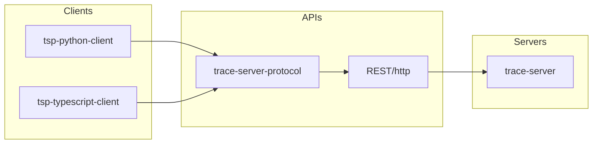
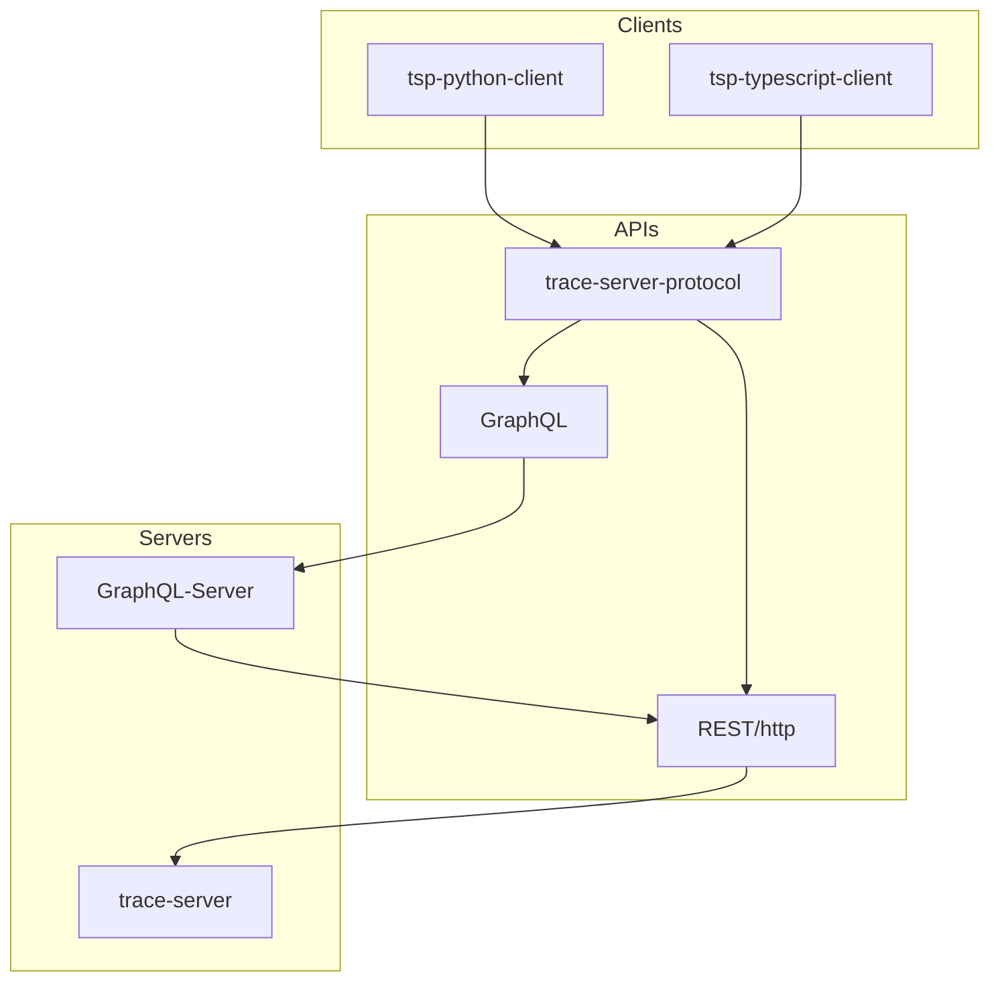
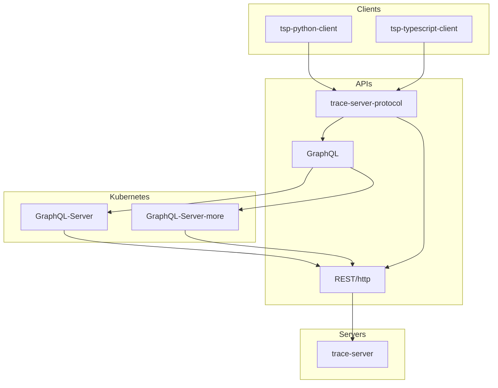

# 2. GraphQL

Date: 2022-01-27

## Status

[Proposed][legend]; WIP (draft).

## Context

### Problem motivation

* We started a preliminary [GraphQL version of the TSP][pr] during 2020.
* We then [opened this issue][issue] in early January 2021.
* [Alternatives to going from current REST to GraphQL][alt] seem limited; [more][more].

### Influences

#### What is GraphQL?

1. [GraphQL is a query language for APIs][org]...
   1. and a runtime for fulfilling those queries with your existing data.
   1. GraphQL provides a complete and understandable description of the data in your API,
   1. gives clients the power to ask for exactly what they ***need and nothing more***,
   1. makes it easier to ***evolve APIs*** over time,
   1. and enables powerful developer tools.

1. From [Pluralsight's Big Picture course][course]:
   * API gets all the needed data in a ***single request***.
   * Moves development focus from server to clients.
      1. Allowing FE and BE teams to ***work more independently***;
      1. no longer depending on endpoint(s) availability;
      1. may depend on [mock][mock] until real data gets served, cf. [Faker][proto];
      1. ***strong typing*** (schema, contract) fosters code predictability.
      1. [GraphiQL][app] (iN-Browser) IDE available; schema self-documents itself.
      1. Frameworks available such as ***[Apollo][fw]***, [Relay][relay].
      1. GraphQL Voyager, and [Faker][proto] (no-code) for future APIs.

### Constraints

Expected [TSP][tsp] features support.

#### Server-side filtering

We need to envision which REST endpoints would this be, to then fully check GraphQL feasibility.

#### Executing actions

* Applying filter.
* Launching analysis, e.g. follow CPU or Thread for Critical Path analysis.

We need to check which REST endpoints these are currently, first.

#### Query Parameters

In TSP's REST API, many POST commands are used to query data because with POST it is possible to

* have query parameters in the request payload;
* avoid sensitive query parameter in URL;
* bypass query parameter limitation of 4k in URL.

From the [Pluralsight course][course]:

1. GraphQL is based on Queries and Mutations.
1. From simple to more complex (any custom) Types.
1. Enum types.
1. Schema (service entry-point),
   * made of Query types (client reads)
   * and optional Mutation types (client writes).
1. ***Aliases*** can be used to co-request about the same field using differing arguments.
1. ***Fragments*** can remove fields list(s) duplication in request.
1. Query (or mutation) operations can be named and support input [variables][var] (parameters).

Can we fit TSP's POST solution above with this GraphQL way of factoring requests?

#### Compression

* Is it possible to compress messages?
* With REST, it is possible to use
  * GZIP compression of the HTTP message, or
  * protobuf instead of JSON.
* [GraphQL JSON with GZIP][gzip].

#### Serialization/de-serialization performance

From the [Pluralsight course][course]:

* ***Caching is optional***, where available, compared to REST (HTTP).
  1. Using an ID as key to re-fetch cached data, at will.
  1. Exclamation marks (ID!) denoting non-[Nullability][null].
  1. ***Paging*** supported by GraphQL clients; [pagination][pag] ([practices][relay]).
  1. Also depending on how our GraphQL resolver functions would perform.

#### Open-source libraries

Language support for server-side and client-side implementation.

* [Pluralsight course][course] mentions GraphQL being [language agnostic][code], [overall][impl].
* Can we quickly confirm this for both clients and server sides?
  * [Python][py] and TypeScript ([JavaScript][js]) for clients;
  * [Java][java] for (trace-)server TSP reference implementation, our currently REST API.
* [Pluralsight][course]: GraphQL open-sourced, with ***large*** [community][comm] involvement.

#### Versioning

According to the [Pluralsight course][course],

* there is ***no API versioning required***,
* because of queried fields flexibility;
* non-breaking API changes enabling.
* [GraphQL versioning][vers].

#### Centralized server

Possible for `trace-server` servicing?

From the [Pluralsight course][course]:

* GraphQL Server able to fetch data from ***legacy system***(s).
  1. By means of writing per-field Resolver functions.
  1. Batched (optimized) resolving supported; [batching][batch].
  1. API gets itself documented through the developing GraphQL schema.

## Decision

### Proposed change

Based on [Mermaid][mermaid] used [in VS Code][ext].

#### Current architecture

Component names above are based on their repository names or directory:

  1. [trace-server][inc]; reference implementation only, could be more servers.
  1. [trace-server-protocol][tsp]; currently based on REST (over HTTP), may evolve.
  1. [tsp-python-client][client-py]; TSP implementation to be used in clients written in Python.
  1. [tsp-typescript-client][client-ts]; TSP implementation used in clients written in TypeScript.

#### GraphQL for TSP API (over REST)

1. GraphQL would be offered as a TSP option alongside current REST endpoints.
1. Resolver functions in GraphQL Server would rely on current REST endpoints.
1. Clients may then gradually benefit from the emerging GraphQL, through TSP.
1. GraphQL Server may then hide more and more endpoints less used by clients.

#### GraphQL containerized (option)

1. Deploying a GraphQL Server using Kubernetes might be more efficient.
1. More than just one Server could be configured also, yet optionally.
1. Scaling (only if needed) depending on trace-server scaling accordingly.
1. Without scaling, deploying GraphQL Server using containers may still help.

#### Testability

[Testing a GraphQL Server using Jest][jest]?

### Agreed implementation

1. We need to discuss the aforementioned potential alternatives or more,
1. then document this section accordingly.

## Consequences

1. Once we agree on an implementation if applicable (above),
2. or anytime during this analysis,
3. we may document the sub-sections right below accordingly.

### Easier to do

* Client requests towards TSP and its GraphQL back-end might be simpler than REST ones (to write).

### More difficult

* Beside already maintaining REST endpoints, writing resolver functions towards them are required.

### Risks introduced

Numbered for further reference.

1. Team effort required to write all the necessary [Resolver functions][course]; [concurred][rh].
2. Gradually adapting every active TSP client to a potentially emerging GraphQL API.
3. [Caching is more complex than with REST][rh]; [challenges][caching].
4. [API maintainers have the additional task of writing maintainable GraphQL schema][rh].
5. [Apollo's potential disadvantages][cons]; doubt about the free version being enough. License ok?
6. [Potentially challenging monitoring][monit].

### Per-risk mitigations

Each number referring to an aforementioned (previously numbered) risk.

1. We could prototype the first few functions towards some prioritized TSP endpoints.
2. We could prioritize clients we are aware of or maintain, while communicating to reach more.
3. We could prototype the use of GraphQL caching enabled, compared to having it disabled.
   * [GraphQL practices][batch].
4. We could measure the effort empirically, compared with already having to document Swagger tags.
   * IBM might have a usable [tool to generate some GraphQL][ibm] from [our existing openapi][yaml].
5. [Apollos's reported advantages][pros] could counter-balance or compensate enough for cons if any.
6. Rather, potentially [Insightful Analytics on the Backend][analytics].

## Next steps

1. Back-log every currently known or potential work item.
2. Keep investigating and likely provision or amend this list further.
3. Potentially consider [Apollo's expected graph principles][princ] to apply.

[alt]: https://www.robinwieruch.de/why-graphql-advantages-disadvantages-alternatives/#graphql-alternatives
[analytics]: https://www.howtographql.com/basics/1-graphql-is-the-better-rest
[app]: https://medium.com/the-graphqlhub/graphiql-graphql-s-killer-app-9896242b2125
[batch]: https://graphql.org/learn/best-practices/#server-side-batching-caching
[caching]: https://www.moesif.com/blog/technical/graphql/REST-vs-GraphQL-APIs-the-good-the-bad-the-ugly/#caching
[client-py]: https://github.com/theia-ide/tsp-python-client
[client-ts]: https://github.com/theia-ide/tsp-typescript-client
[code]: https://graphql.org/code/
[comm]: https://graphql.org/community/#official-channels
[cons]: https://www.robinwieruch.de/why-apollo-advantages-disadvantages-alternatives/#apollo-disadvantages
[course]: https://app.pluralsight.com/library/courses/graphql-big-picture/table-of-contents
[ext]: https://marketplace.visualstudio.com/items?itemName=bierner.markdown-mermaid
[fw]: https://www.apollographql.com
[gzip]: https://graphql.org/learn/best-practices/#json-with-gzip
[ibm]: https://github.com/IBM/openapi-to-graphql
[impl]: https://github.com/chentsulin/awesome-graphql#implementations
[inc]: https://git.eclipse.org/r/plugins/gitiles/tracecompass.incubator/org.eclipse.tracecompass.incubator/+/refs/heads/master/trace-server/
[issue]: https://github.com/theia-ide/trace-server-protocol/issues/45
[java]: https://graphql.org/code/#java-kotlin
[jest]: https://medium.com/entria/testing-a-graphql-server-using-jest-4e00d0e4980e
[js]: https://graphql.org/code/#javascript
[legend]: https://cognitect.com/blog/2011/11/15/documenting-architecture-decisions
[mermaid]: https://towardsdatascience.com/mermaid-create-diagrams-quickly-and-effortlessly-d236e23d6d58
[mock]: http://graphql.org/blog/mocking-with-graphql/
[monit]: https://www.moesif.com/blog/technical/graphql/REST-vs-GraphQL-APIs-the-good-the-bad-the-ugly/#non-existent-monitoring
[more]: https://leapgraph.com/rest-api-alternatives/
[null]: https://graphql.org/learn/best-practices/#nullability
[org]: https://graphql.org
[pag]: https://graphql.org/learn/best-practices/#pagination
[pr]: https://github.com/theia-ide/trace-server-protocol/pull/44
[princ]: https://principledgraphql.com
[pros]: https://www.robinwieruch.de/why-apollo-advantages-disadvantages-alternatives/#apollo-advantages
[proto]: https://github.com/chentsulin/awesome-graphql#tools---prototyping
[py]: https://graphql.org/code/#python
[relay]: https://www.apollographql.com/blog/graphql/pagination/understanding-pagination-rest-graphql-and-relay/
[rh]: https://www.redhat.com/en/topics/api/what-is-graphql#pros-and-cons
[tsp]: https://github.com/theia-ide/trace-server-protocol
[var]: https://medium.com/the-graphqlhub/graphql-tour-variables-58c6abd10f56
[vers]: https://graphql.org/learn/best-practices/#versioning
[yaml]: https://github.com/theia-ide/trace-server-protocol#alternate-tsp-version
