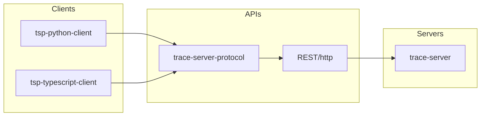
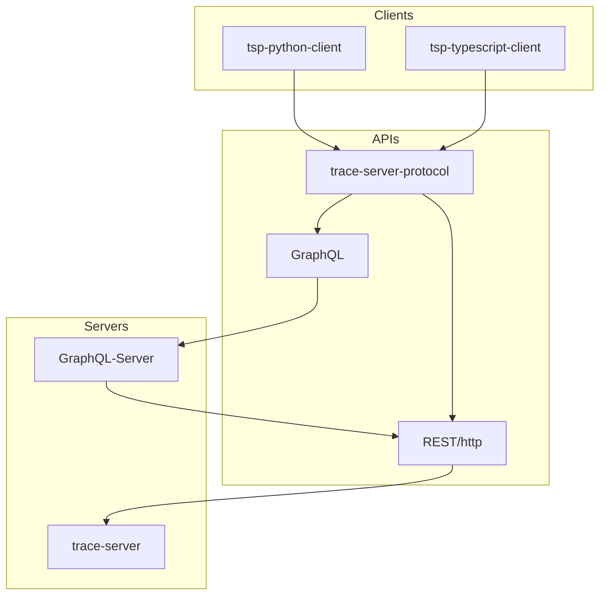
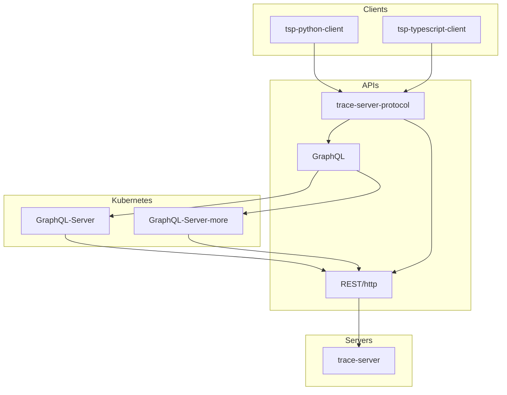

# 2. GraphQL

Date: 2022-04-26

## Status

[Proposed][legend]

## Context

### Problem motivation

* We started a preliminary [GraphQL version of the TSP][pr] during 2020.
* We then [opened this issue][issue] in early January 2021.
* [Alternatives to going from current REST to GraphQL][alt] seem limited; [more][more].

#### Use cases yet to support

These are [high level][org] (non-TSP specific), so will require focused [TSP][tsp] prototyping.

1. ***Describe*** client schemas based on potentially refactored [domain][language] resolutions.
1. ***Dimension*** client requests towards trace servers solely out of the needed information.
1. Get potentially more ***predictable*** and scaled results with only the requested data ranges.
1. ***Combine*** more than just one trace data source or server in request if resolvable so.
1. Enable both API compatibility and ***evolution***, through being version-agnostic in requests.
1. Allow potential ***custom*** resolution logic between clients and trace data sources, at scale.
1. [Keep REST support or ***iterate*** towards GraphQL][iter] use in virtually any TSP client.

#### And their stakeholders

There is no mapping between these roles and aforementioned use cases, as many may apply to many.

1. TSP ***client*** developers, users or integrators; [Python][client-py], [TypeScript][client-ts].
1. Trace ***application*** developers, either [Theia][theia] or Eclipse (or else, potentially).
1. Trace ***solution*** architects and marketeers, potentially.
1. Trace ***users*** in general;
   * either indirectly through solution usage if aware of it,
   * or directly (once), if coding queries against trace servers.
1. GraphQL ***resolver*** developers may arise as a new sub-role,
   * part of developing GraphQL support.
   * They may become central to supporting GraphQL initially in the key team(s).
1. Trace-***server*** implementation(s) developers:
   * as they look into supporting incoming Graph server (resolved) requests through REST as usual;
   * while potentially working on refactoring that TSP support based on GraphQL servicing in Java.
   * Replacing (or supplementing) REST with non-REST (Graph-only) in TSP/server being non-trivial.

### Influences

#### What is GraphQL?

1. [GraphQL is a query language for APIs][org]...
   1. and a runtime for fulfilling those queries with your existing data.
   1. GraphQL provides a complete and understandable description of the data in your API,
   1. gives clients the power to ask for exactly what they ***need and nothing more***,
   1. makes it easier to ***evolve APIs*** over time,
   1. and enables powerful developer tools.

1. From [Pluralsight's Big Picture course][course]:
   * API gets all the needed data in a ***single request***.
   * Moves development focus from server to clients.
      1. Allowing FE and BE teams to ***work more independently***;
      1. no longer depending on endpoint(s) availability;
      1. may depend on [mock][mock] until real data gets served, cf. [Faker][proto];
      1. ***strong typing*** (schema, contract) fosters code predictability.
      1. [GraphiQL][app] (iN-Browser) IDE available; schema self-documents itself.
      1. Frameworks available such as ***[Apollo][fw]***, [Relay][relay].
      1. GraphQL Voyager, and [Faker][proto] (no-code) for future APIs.

### Constraints

Expected [TSP][tsp] features support.

#### Server-side filtering

* Current TSP `/table/{outputId}/lines` is the main endpoint supporting [trace-server][inc] filtering.
* Such filtering is optionally requested by clients through TSP [Query Parameters](#query-parameters).
* A model tagging the matching table lines and columns (or cells) gets returned as a response.
* This is captured by `trace-server`'s `TableLine` abstractions and implementations.
* GraphQL's ability to support event table search filters is thus [discussed below](#query-parameters).
* Filtering or searching an event table is based on the requested search expressions and direction.
* Such search expressions may for example be about specific CPU(s) usage or other traced resources.

#### Query Parameters

In TSP's REST API, many POST commands are used to query data because with POST it is possible to

* have query parameters in the request payload;
* avoid sensitive query parameter in URL;
* bypass query parameter limitation of 4k in URL.

From the [Pluralsight course][course]:

1. GraphQL is based on Queries and Mutations.
1. From simple to more complex (any custom) Types.
1. Enum types.
1. Schema (service entry-point),
   * made of Query types (client reads)
   * and optional Mutation types (client writes).
1. ***Aliases*** can be used to co-request about the same field using differing arguments.
1. ***Fragments*** can remove fields list(s) duplication in request.
1. Query (or mutation) operations can be named and support input [variables][var] (parameters).

TSP's aforementioned POST solution fits with this GraphQL way of factoring requests, depending.

* An extensive GraphQL queries schema such as [this legacy one][pr] could be eventually considered.
* Such a schema, although extensively detailed and split or itemized, would still require Resolvers.
* This ADR [describes what GraphQL resolvers are](#apollo-server-trial) further on.
* Or, an initial schema could be simpler, like [this ADR's prototype](#apollo-server-prototype-tsp).
* In such a more trivial (naive) case, resolver(s) logic gets closer to current TSP clients; e.g.:

```javascript
const { Query } = require('tsp-typescript-client/lib/models/query/query');

const response = await tspClient.fetchTimeGraphTree(
  '50484c19-f1af-3af3-841a-0d821ed393d2',
  'org.eclipse.tracecompass.analysis.os.linux.core.cpuusage.CpuUsageDataProvider',
  new Query({'parameters': {
    'requested_items': [1846, 1980],
    'requested_times': [1332170683462577664, 1332170684485022208]
  }})
);
```

The above example assumes this ADR's own [prototype](#apollo-server-prototype-tsp) `tspClient`,

* along with the related and already existing TSP (REST) [TypeScript client][client-ts].
* Values hardcoded above are a local subset of TSP's [Python client][client-py] test data.
* This example is shown above for illustration purposes, but was confirmed as working prior.
* That code can be made into a `resolver` with its name added to prototype's `type Query` schema.
* Resolver is built using prototype's existing ones as template but requires [test data][client-py].
* For example, such a resolver may return `response.getModel().model.entries.length` or the like.
* Prototype's `./test` script can be amended accordingly and used to run the resulting query.

This example of course remains trivial and shall benefit from [GraphQL types][pr] and parameters.

#### Compression

* With REST, it is possible to use
  * GZIP compression of the HTTP message, or
  * protobuf instead of JSON.
* [GraphQL JSON with GZIP][gzip].

#### Serialization/de-serialization performance

From the [Pluralsight course][course]:

* ***Caching is optional***, where available, compared to REST (HTTP).
  1. Using an ID as key to re-fetch cached data, at will.
  1. Exclamation marks (ID!) denoting non-[Nullability][null].
  1. ***Paging*** supported by GraphQL clients; [pagination][pag] ([practices][relay]).
  1. Also depending on how our GraphQL resolver functions would perform.

#### Open-source libraries

Language support for server-side and client-side implementation.

* [Pluralsight course][course] mentions GraphQL being [language agnostic][code], [overall][impl].
* Quickly confirming that for both clients and server sides, herein:
  * [Python][py] and TypeScript ([JavaScript][js]) for clients.
    1. Similarly to [Apollo Client](#apollo-client-optional), these clients are optional for TSP use.
    1. Thus, TSP's current [Python][client-py] and [TypeScript][client-ts] clients base should suffice.
    1. These existing TSP clients would only require GraphQL queries towards a GraphQL (trace) server.
    1. One could then still consider more feature-rich GraphQL clients, upon such confirmed basic use.
    1. This ADR focuses on adapting TSP's clients to check GraphQL usability for them, if decided so.
  * [Java][java] for (trace-)server TSP reference implementation, our (currently REST) API.
    1. `graphql-java` is [a library][java-hw] on GitHub that supports [fetching data][java-fd] directly.
    1. It [can be built using Maven][java-mvn] and would enable non-REST (direct) use of trace data.
    1. `GraphQL Java Generator` ([listed][java] too) can help providing boilerplate `graphql-java` code.
    1. This ADR focuses on first integrating GraphQL clients towards the existing (REST) `trace-server`.
    1. Such (TSP) clients would then first query Graph data through a GraphQL server resolving to REST.
* [Pluralsight][course]: GraphQL open-sourced, with ***large*** [community][comm] involvement.

#### Versioning

According to the [Pluralsight course][course],

* there is ***no API versioning required***,
* because of queried fields flexibility;
* non-breaking API changes enabling.
* [GraphQL versioning][vers].

#### Centralized server

* Possible for `trace-server` servicing, as this ADR shows [next](#proposed-change).
* From the [Pluralsight course][course]:
  * GraphQL Server able to fetch data from ***legacy system***(s).
    1. By means of writing per-field Resolver functions.
    1. Batched (optimized) resolving supported; [batching][batch].
    1. API gets itself documented through the developing GraphQL schema.

## Decision

### Proposed change

Based on [Mermaid][mermaid] used [in VS Code][ext].

#### Current architecture



Component names above are based on their repository names or directory:

  1. [trace-server][inc]; reference implementation only, could be more servers.
  1. [trace-server-protocol][tsp]; currently based on REST (over HTTP), may evolve.
  1. [tsp-python-client][client-py]; TSP implementation to be used in clients written in Python.
  1. [tsp-typescript-client][client-ts]; TSP implementation used in clients written in TypeScript.

#### GraphQL for TSP API (over REST)



1. GraphQL would be offered as a TSP option alongside current REST endpoints.
1. Resolver functions in GraphQL Server would [rely on current REST endpoints][rest].
1. Clients may then gradually benefit from the emerging GraphQL, through TSP.
1. GraphQL Server may then hide more and more endpoints less used by clients.

#### GraphQL containerized (option)



1. Deploying a GraphQL Server using Kubernetes might be more efficient.
1. More than just one Server could be configured also, yet optionally.
1. Scaling (only if needed) depending on trace-server scaling accordingly.
1. Without scaling, deploying GraphQL Server using containers may still help.

#### Apollo Server trial

1. Apollo's [Getting-started][svr-start] steps were tried once, locally, while preparing this ADR.
1. Those steps simply show how a GraphQL query may request data based on a schema (`index.js`).
1. For server to know how to provide that data, a `resolver` function was part of `index.js`, then.
1. [Apollo][svr-start] is [OSS][svr-open], with [***optional*** commercial add-ons][svr-opt].
   * It is [a TypeScript server based on Node.js][svr-open].
   * It has [built-in][svr-rest], [REST](#GraphQL-for-TSP-API-(over-REST)) resolver data support.
   * Should that support not fit TSP's endpoints, [tsp-typescript-client][client-ts] could be used.
1. Server doesn't require Kubernetes or a container-based deployment, which then remains optional.
1. Server doesn't require using the [potentially licensed Apollo Studio][svr-opt] either.

#### Apollo Client: optional

* [Apollo Client][svr-client] seems to be mainly [open-source][svr-client-open] too.
* It is mostly intended as [a caching aid][svr-client-caching]; to be referred to, maybe, later on.
* It is [based on React][svr-client], but [other integrations are listed][svr-client-open].
* This ADR doesn't require a deeper analysis yet, given TSP's current clients to integrate first.

#### Apollo Server prototype (TSP)

* Initialized based on the aforementioned trial [steps][svr-start].
* Showing a few small JavaScript resolvers in `index.js` for TSP `/health` and `/traces` endpoints.
* Which then relies on [tsp-typescript-client][client-ts] already part of this repository.
* Allowing this currently small prototype to potentially expand with more resolvers or trials.
* The steps below that exercise this prototype depend on a locally running, default `trace-server`.

```bash
cd ./0002/graphql-server-prototype
yarn
node index.js
./test
````

* Above, the `test` script is to be run from another terminal, after having launched the server.
* There is a VS Code launch configuration in this repository that can also run `node index.js`.

#### Testability

This [other PS course][course-test] likely summarizes GraphQL testability features well:

* This ADR discards starting with Apollo Client, but the latter remains testable if ever used.
* Indeed, specific Apollo Client ***hooks*** based on React can be used for that purpose.
* If rather using custom GraphQL client code as this ADR proposes,
  1. such resolvers code (in, e.g., Apollo Server) can be unit-tested,
  1. optionally using mocks with different levels of default response values.
* Alongside such unit-level tests, integration tests may be used, based on Jest.
  1. Optionally, usual Jest snapshots can be used to compare expected server responses.
  1. Should the GraphQL schema be unavailable for client-side testing (although unlikely),
  1. introspection may be used for client testing to discover what server provides.
* There are also different levels of error handling possible,
  * from all-default
  * to app-specific;
  * depends on how network errors shall be handled by client.

Now that course focuses on a JavaScript-based stack,

* but GraphQL already supports multiple popular languages with testability features.
* Potentially more on [Testing a GraphQL Server using Jest][jest].

### Agreed implementation

1. We need to discuss the aforementioned potential alternatives or more,
1. then document this section accordingly.
1. For now though, it has been decided to not pursue GraphQL because:
   1. there is no known client that requires solving a TSP usability issue today;
   1. a new TSP client might be required as a worthy GraphQL ramp-up experience.
   1. Some client benefit(s) that can be short-term enough is required for this.
   1. There should be no significant server rewrite without a client benefit.
   1. There should be no significant resolver writing effort without benefits.
   1. TSP (HTTP) already has options that support working around REST constraints.

## Consequences

1. Once we agree on an implementation if applicable (above),
1. we may amend the sub-sections right below accordingly.

### Easier to do

* Client requests towards TSP and its GraphQL back-end might be simpler than REST ones (to write).

### More difficult

* Beside already maintaining REST endpoints, writing resolver functions towards them are required.

### Risks introduced

Numbered for further reference.

1. Team effort required to write all the necessary [Resolver functions][course]; [concurred][rh].
2. Gradually adapting every active TSP client to a potentially emerging GraphQL API.
3. [Caching is more complex than with REST][rh]; [challenges][caching].
4. [API maintainers have the additional task of writing maintainable GraphQL schema][rh].
5. [Apollo's potential disadvantages][cons]; doubt about the free version being enough. License ok?
6. [Potentially challenging monitoring][monit].

### Per-risk mitigations

Each number referring to an aforementioned (previously numbered) risk.

1. We could prototype the first few functions towards some prioritized TSP endpoints.
2. We could prioritize clients we are aware of or maintain, while communicating to reach more.
3. We could prototype the use of GraphQL caching enabled, compared to having it disabled.
   * [GraphQL practices][batch].
4. We could measure the effort empirically, compared with already having to document Swagger tags.
   * IBM might have a usable [tool to generate some GraphQL][ibm] from [our existing openapi][yaml].
5. [Apollos's reported advantages][pros] could counter-balance or compensate enough for cons if any.
6. Rather, potentially [Insightful Analytics on the Backend][analytics].

## Next steps

1. Resume the work on this GraphQL proposal, if ever (once) deemed necessary.
1. Potentially consider [Apollo's expected graph principles][princ] to apply.

[alt]: https://www.robinwieruch.de/why-graphql-advantages-disadvantages-alternatives/#graphql-alternatives
[analytics]: https://www.howtographql.com/basics/1-graphql-is-the-better-rest
[app]: https://medium.com/the-graphqlhub/graphiql-graphql-s-killer-app-9896242b2125
[batch]: https://graphql.org/learn/best-practices/#server-side-batching-caching
[caching]: https://www.moesif.com/blog/technical/graphql/REST-vs-GraphQL-APIs-the-good-the-bad-the-ugly/#caching
[client-py]: https://github.com/eclipse-cdt-cloud/tsp-python-client
[client-ts]: https://github.com/eclipse-cdt-cloud/tsp-typescript-client
[code]: https://graphql.org/code/
[comm]: https://graphql.org/community/#official-channels
[cons]: https://www.robinwieruch.de/why-apollo-advantages-disadvantages-alternatives/#apollo-disadvantages
[course]: https://app.pluralsight.com/library/courses/graphql-big-picture/table-of-contents
[course-test]: https://app.pluralsight.com/library/courses/apollo-testing/table-of-contents
[ext]: https://marketplace.visualstudio.com/items?itemName=bierner.markdown-mermaid
[fw]: https://www.apollographql.com
[gzip]: https://graphql.org/learn/best-practices/#json-with-gzip
[ibm]: https://github.com/IBM/openapi-to-graphql
[impl]: https://github.com/chentsulin/awesome-graphql#implementations
[inc]: https://git.eclipse.org/r/plugins/gitiles/tracecompass.incubator/org.eclipse.tracecompass.incubator/+/refs/heads/master/trace-server/
[issue]: https://github.com/eclipse-cdt-cloud/trace-server-protocol/issues/45
[iter]: https://graphql.org/learn/thinking-in-graphs/#business-logic-layer
[java]: https://graphql.org/code/#java-kotlin
[java-fd]: https://www.graphql-java.com/documentation/data-fetching/#how-graphql-fetches-data
[java-hw]: https://www.graphql-java.com/documentation/getting-started/#hello-world
[java-mvn]: https://www.graphql-java.com/documentation/getting-started/#how-to-use-the-latest-release-with-maven
[jest]: https://medium.com/entria/testing-a-graphql-server-using-jest-4e00d0e4980e
[js]: https://graphql.org/code/#javascript
[language]: https://graphql.org/learn/thinking-in-graphs/#shared-language
[legend]: https://cognitect.com/blog/2011/11/15/documenting-architecture-decisions
[mermaid]: https://towardsdatascience.com/mermaid-create-diagrams-quickly-and-effortlessly-d236e23d6d58
[mock]: http://graphql.org/blog/mocking-with-graphql/
[monit]: https://www.moesif.com/blog/technical/graphql/REST-vs-GraphQL-APIs-the-good-the-bad-the-ugly/#non-existent-monitoring
[more]: https://leapgraph.com/rest-api-alternatives/
[null]: https://graphql.org/learn/best-practices/#nullability
[org]: https://graphql.org
[pag]: https://graphql.org/learn/best-practices/#pagination
[pr]: https://github.com/eclipse-cdt-cloud/trace-server-protocol/pull/44
[princ]: https://principledgraphql.com
[pros]: https://www.robinwieruch.de/why-apollo-advantages-disadvantages-alternatives/#apollo-advantages
[proto]: https://github.com/chentsulin/awesome-graphql#tools---prototyping
[py]: https://graphql.org/code/#python
[relay]: https://www.apollographql.com/blog/graphql/pagination/understanding-pagination-rest-graphql-and-relay/
[rest]: https://graphql.org/faq/#does-graphql-replace-rest
[rh]: https://www.redhat.com/en/topics/api/what-is-graphql#pros-and-cons
[svr-client]: https://www.apollographql.com/docs/react/
[svr-client-caching]: https://www.apollographql.com/docs/react/caching/overview/
[svr-client-open]: https://github.com/apollographql/apollo-client
[svr-open]: https://github.com/apollographql/apollo-server
[svr-opt]: https://www.apollographql.com/pricing/
[svr-rest]: https://www.apollographql.com/docs/apollo-server/data/data-sources/#restdatasource-reference
[svr-start]: https://www.apollographql.com/docs/apollo-server/getting-started/
[theia]: https://github.com/eclipse-cdt-cloud/theia-trace-extension
[tsp]: https://github.com/eclipse-cdt-cloud/trace-server-protocol
[var]: https://medium.com/the-graphqlhub/graphql-tour-variables-58c6abd10f56
[vers]: https://graphql.org/learn/best-practices/#versioning
[yaml]: https://github.com/eclipse-cdt-cloud/trace-server-protocol#generate-the-api
