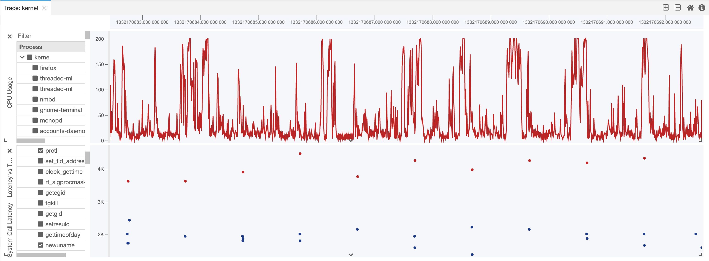
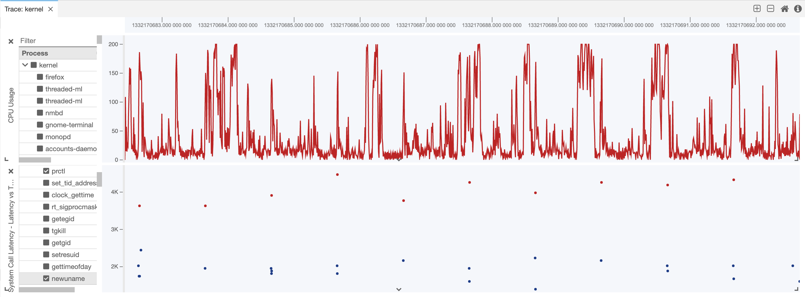

# 3. D3 charts

Date: 2022-02-24

## Status

Proposed.

## Context

ChartJS is a library that facilitates the rendering of data in web applications, but it has limitations.

By using D3 it would be possible to implement all the functionalities currently built with ChartJS, allow the implementation of many more, and reduce code complexity.

This ADR considers the idea and the cost of using D3 instead of ChartJS to render line charts, scatter charts and other types of charts.

### Current limitations

ChartJS does not allow rendering HTML elements on top of its canvas. In order to display the vertical blue line that indicates where the user clicked on the chart, a complex implementation involving multiple abstract classes is necessary. Such solution is unnecessarily complex and hard to maintain. D3 allows the integration of features like this with less code and greater simplicity.

Another example are the axis of the charts, which are currently implemented in separate classes from the charts themselves. The y-axis is already implemented with D3. Converting also the charts to D3 would allow a reduced and cleaner code base, which again favors maintainability.

The current implementation of the tooltip is a custom solution that would not be possible to implement with ChartJS. D3 is easier to integrate with custom solutions like this, reducing the time required to develop future improvements.

Small details to improve usability, like highlighting points or lines on hover, are easier to implement with D3. One use case ChartJS failed to deliver recently was highlighting points in the scatter plots when more than one series was plotted. ChartJS allows highlighting only one point.

D3 allows the implementation of small custom details like this one, which enriches the application.

Finally, D3 is a much broader chart library. Implementations beyond the line, scatter, bar and area charts are available and have the potential to improve the application in ways not yet envisioned.

## Decision

Theia Trace Extension already has the D3 library installed. It is currently being used to render the y-axis in some charts. There is no need to install new packages.

As an example, replacing the line and the scatter charts used in `xy-output-component.tsx` requires:

- Importing one extra library from D3:

```js
import { line } from 'd3-shape';
```

- Replacing ChartJS' Scatter plot with a canvas.

Remove:

```js
return (
	<Scatter
		ref={this.chartRef}
		plugins={[this.plugin]}
		data={this.state.xyData}
		height={parseInt(this.props.style.height.toString())}
		options={scatterOptions}
	/>
)
```

Add:

```js
return (
	<canvas
		ref={this.chartRef}
		height={chartHeight}
		width={chartWidth}
	/>
)
```

- Defining D3's domain and scale functions. Some of these functions are already in place for the y-axis, and can be re-used:

```js
const yScale = scaleLinear()
	.domain([this.state.allMin, Math.max(this.state.allMax, 1)])
	.range([chartHeight - this.margin.bottom, this.margin.top]);

const xDomain = this.state.xyData.labels.length - 1;

const xScale = scaleLinear()
	.domain([this.state.xyData.labels[0], this.state.xyData.labels[xDomain]].map(Number))
	.range([0, chartWidth]);

const xScale2 = scaleLinear()
	.domain([this.state.xyData.labels[0], this.state.xyData.labels[xDomain]].map(Number))
	.range([this.margin.left, chartWidth - this.margin.right]);

const lineData = line()
	.x((d: any) => xScale(Number(d.xValue)))
	.y((d: any) => yScale(+d.yValue) - 0.5)
	.context(ctx);
```

- Drawing the chart

```js
ctx.clearRect(0, 0, chartWidth, chartHeight);
ctx.save();
data.forEach((row, i) => {
	ctx.lineWidth = 2;
	ctx.strokeStyle = this.state.xyData.datasets[i].borderColor;
	ctx.fillStyle = this.state.xyData.datasets[i].borderColor;
	if (this.isScatterPlot){
		row.forEach((point: any)=> {
			ctx.beginPath();
			const cx = xScale2(Number(start) + point.xValue);
			const cy = yScale(point.yValue);
			ctx.arc(cx, cy, 2, 0, 2 * Math.PI);
			ctx.stroke();
			ctx.fill();
			ctx.closePath();
		});
	} else {
		ctx.beginPath();
		lineData(row);
		ctx.stroke();
		ctx.closePath();
	}
});
ctx.restore();
```

- Adjust references and remove ChartJS

Replace occurrences of `this.chartRef.current.chartInstance` with `this.chartRef.current`.

A [full implementation][implementation] of this solution is available as part of this ADR.

For comparison, here are the line chart and the scatter chart rendered using D3:



And the same charts rendered with ChartJS:



## Consequences

### What becomes more difficult

D3 has a steep learning curve. Even the most simple chart requires deep understanding of how many libraries and manipulation of the data so that it can be used by these libraries.

Every different chart requires again time and practice to be implemented.

Specially the first implementation of a new solution with D3 takes a long time of study and trial in order to work, more so than libraries like ChartJS.

### What becomes easier

After a first example is implemented, like a line chart, the same code can be easily reused for similar solutions. Therefore, having a team member with experience in D3 greatly reduces the effort necessary to learn and use the library.

Due to its versatility, nearly any solution can be implemented in the project. The product is not limited by the few solutions of a library, as it happens with ChartJS.

Also, customization becomes more accessible. As stated above, some aspects of the tooltip could not be implemented in this project due to the limitations of ChartJS.

### Conclusion

D3 is a complex and powerful library with a steep learning curve. But having a team member with experience using it greatly diminishes the barriers of adoption.

Once it is integrated into the project, great possibilities for customization and expansion of functionality become accessible.

[implementation]: ./0003/proto_xy-output-component.tsx
