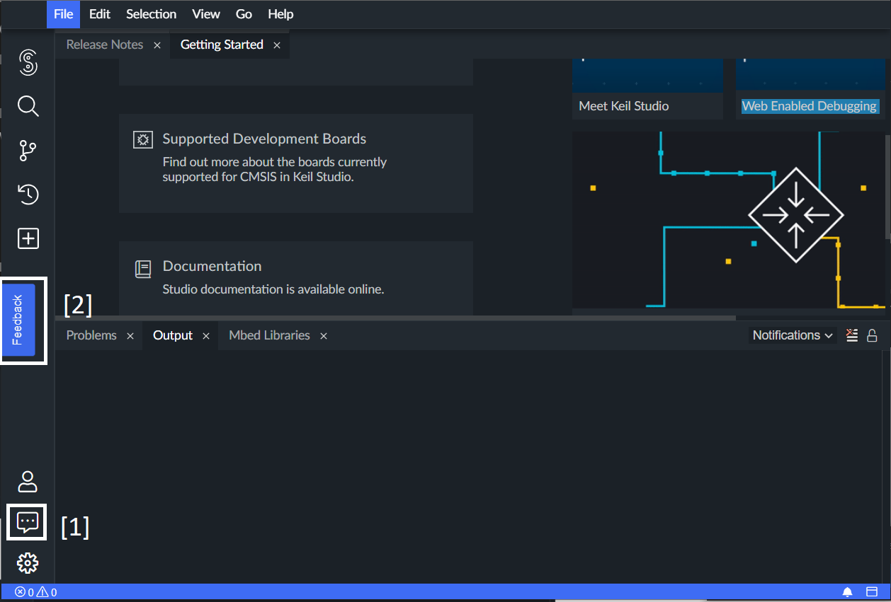
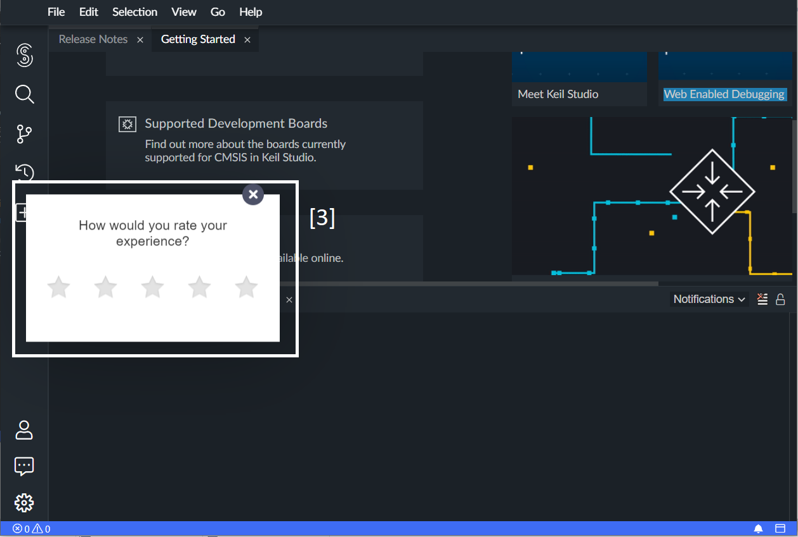

# 3. Using hotjar to track user happiness

Date: 2022-03-08

## Status

[Declined][legend].

## Context

### Problem motivation

* We would like to track user happiness of the Theia Trace Extension. By obtaining feedback from both internal and external users, we can improve the UI/UX of the Trace Extension.

### Influences

#### What is Hotjar?

* [Hotjar][hotjar] is a third-party user behavior analytics software. It provides several metrics to analyze user behavior and integrate surveys into web applications. 
* Some of the most notable features are:
    * [Surveys][survey]: Hotjar allows us to create surveys on our website as a UI Widget.
    * [Incoming feedback][feedback]: A UI widget that allow the users to rate the website and provide a textbox for feedback.
* All data obtained from users are stored on our Hotjar account. We use this account to create UI Widgets, and we view the feedback using this account as well. 

#### Keil Studio
* Currently, Keil Studio uses Hotjar to track user happiness for Keil Studio. Keil Studio is a editor built using Theia, so this is an example of how the Trace Extension can be integrated with Hotjar.
* In Keil Studio, there is a feedback icon at the lower left corner of the UI [1]. Once the user clicked on this icon, a feedback UI widget is displayed on the left side of the screen [2]. Clicking on this widget will display a pop-up form, where users can rate the application from 1 to 5 stars [2]. This is done by Hotjar. We would like to create a similar widget for the Trace Extension.





### Constraints

#### What we need
1. A UI widget that allows users to provide feedback.
2. We would like to obtain feedback from both internal/external users.
3. A centralized database/location to store the results of feedback information for all domains that uses Trace Compass, both internal and external.
4. No commercial dependencies.

#### Hotjar limitations

* Hotjar requires us to do the following things to integrate: 
    1. First, we need to register the domain of our web application with Hotjar.
    2. We need to add some [tracking code][tracking] to the ```<head>``` element of the web application. This code is provided by Hotjar.
    3. After adding the code, we need to login to our Hotjar account and trigger the validation process. 
* If we decide to support both internal and external domains, this might create possible issues in the future with the ever growing number of domains, unless we are sure that the number of domains do not change.
* Each domain must create its own UI Widget, thus the results are not centralized.
* Also, since the Trace Extension is part of Theia, we need to inject the Hotjar code into Theia ```<head>``` element. This brings up the question of how can we inject the code gracefully.
* Hotjar has multiple pricing options. The free version allows the creation of 3 incoming feedback and surveys at a time. If we need more, then we cannot use Hotjar as it creates commercial dependencies.

## Decision

This proposal was declined since using Hotjar would add a commercial dependency to Theia Trace Extension, which goes against #4 of our [constraints](app-constraints). In order to achieve all the requirements, it would be necessary to purchase a paid subscription from Hotjar to gain access to specific [APIs](apis), which is unfeasible in an open source project as Theia Trace Extension.

## Consequences

We need to investigate other options for tracking user happiness.

[apis]: https://help.hotjar.com/hc/en-us/articles/360033640653
[app-constraints]: #what-we-need
[feedback]: https://www.hotjar.com/product/incoming-feedback/
[heatmap]: https://www.hotjar.com/heatmaps/
[hotjar]: https://www.hotjar.com/
[legend]: https://cognitect.com/blog/2011/11/15/documenting-architecture-decisions
[survey]: https://www.hotjar.com/product/surveys/
[tracking]: https://help.hotjar.com/hc/en-us/articles/115009336727-How-to-Install-your-Hotjar-Tracking-Code
