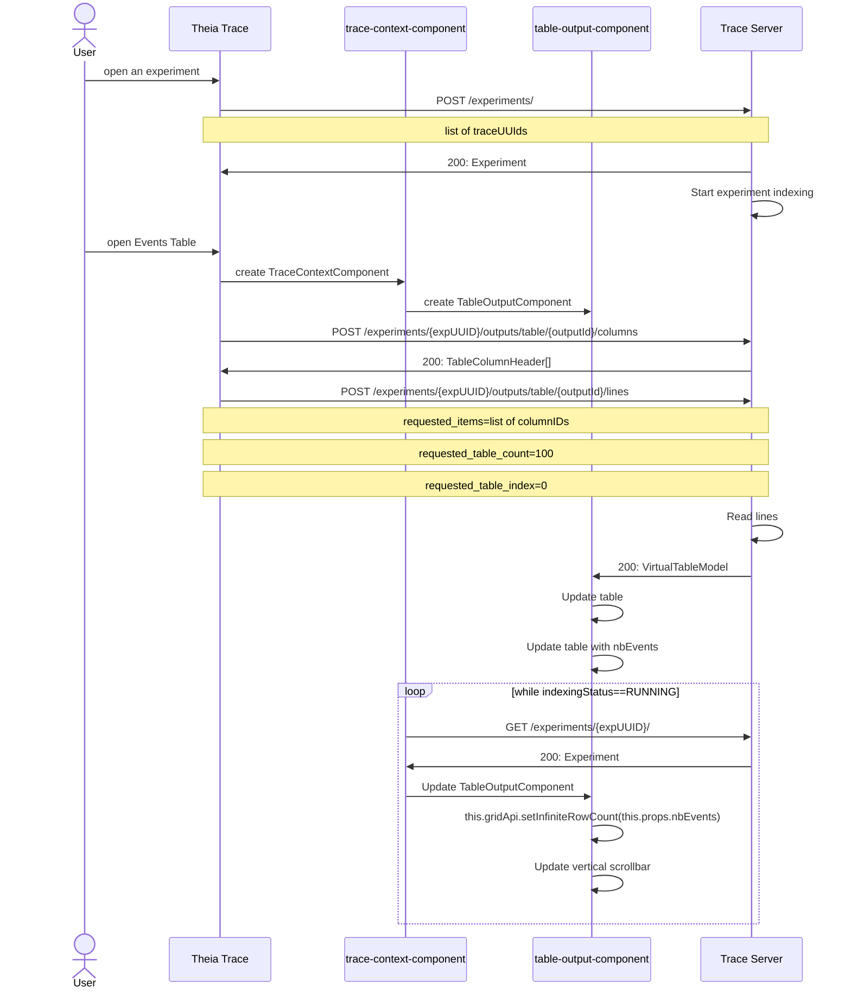
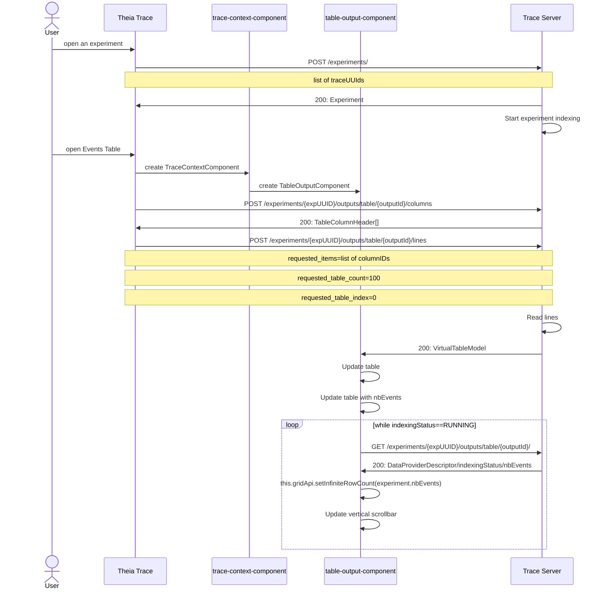
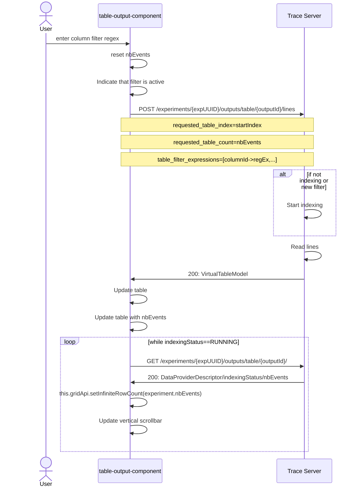
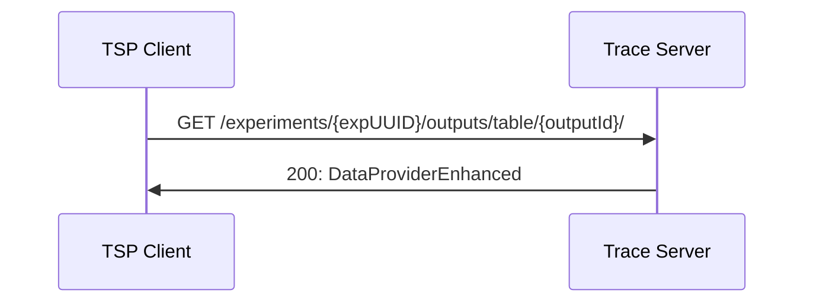
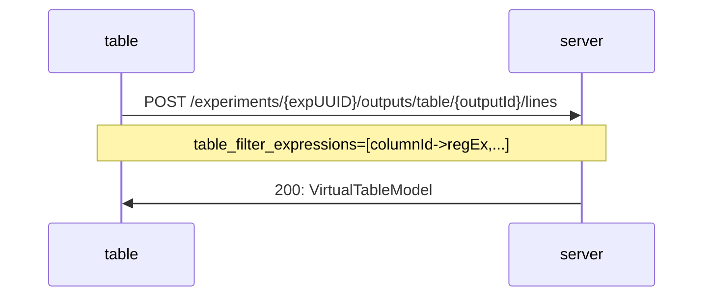

# 6. Table filtering

Date: 2022-09-08

## Status

[Proposed][legend]

## Context

The events table has the possibility to search using regular expressions per column. This ADR is to discuss the changes needed in the [Trace Server Protocol (TSP)][tsp] and sequences of messages to support filtering out non-matching events.

The events table uses the virtual table endpoint of the Trace Server Protocol.

A virtual table is a table that doesn't load all available events (rows) of a trace into the memory. Instead it reads a certain number of rows at a time into memory and updates the events if the user navigates out of the range of the cached events. The total number of events needs to be available, so that the row numbers can be calculated when scrolling inside the table. For fast updates, the back-end will need to implement an index to be able to seek quickly to events of interest inside the trace.

Any data provider implementing the virtual table endpoint will benefit from the filtering feature. The Trace Compass trace server provides currently 2 different data providers that implement the virtual table endpoint: `Events Table` and `Latency Tables` (Segment Store Table).

Upon opening of an experiment the `trace-context-component` periodically polls the `/experiments/{expUUID}` endpoint and stores the experiment with the total number of events it has, and then triggers a redraw of the table. This redraw will trigger a call to the `componentDidUpdate` method of `TableOutputComponent` which calls the method `setInfiniteRowCount()` to set the current number of events. Using the experiment endpoint is only valid for the events table because the total number of events in the table is the total number of events of the experiment. For other data providers like the segment store table, this procedure is not working, because the number of segments in such a table is not equal to the number of events in the experiment.

### Open the events table (Current)



### Open the events table (New)

In order to support a generic way to update the total number of rows in the table, the periodic polling of the number of events has to be decoupled from the `/experiment/{expUUID}` endpoint and moved to the virtual table endpoint of the TSP, so that the indexing status and current number of rows can be queried per data provider.



### Filtering

When a user applies a filter by entering a regular expression into the column filter box, then the table needs to be reset, indexing has to be triggered on the back-end and the front-end needs to pool the indexing progress.



### Indexing TSP updates

The following endpoint needs to be added to the TSP to query the indexing progress:



The returned data structure includes the data provider descriptor, indexingStatus and optional number of items.

```javascript
DataProviderEnhanced {
    descriptor: DataProvider,
    indexingStatus: RUNNING|COMPLETED
    nbItems?: long
}
```

See [DataProvider][dp] data structure in the TSP for more details.

### Table Filtering TSP updates

The following query parameters need to be updated to support filtering of the virtual table:



When the back-end receives a lines query with `table_filter_expressions`, it will first verify if the filter is the same as before. If the filter changed, then the ongoing back-end indexing is cancelled and a new indexing thread is started. It will return up to `requested_table_count` number of matching rows. However, to not read the whole trace to get that number of rows, it shall limit the number of rows read.

## Decision

The change that we're proposing or have agreed to implement, will be implemented.

## Consequences

### Easier to do

This is a completely new feature for the virtual tables in the theia-trace-viewer. Once implemented, it will greatly enhance the feature capabilities of virtual tables. It will help users to reduce the data that needs to be looked at and will help finding lines of interest. It will make certain investigations easier for the user.

### More difficult

The server implementation of that endpoint will be more complicated to do. Each such virtual data provider will need to support this capability. The 2 implementations of the virtual table data provider of Trace Compass server need to be updated. It's recommended to refactor current code to allow for code re-use.

To reduce the need for the support of all the query parameters, the concept of capabilities can be introduced in the TSP, where the client can query supported capabilities and depending on what is supported in the server it can hide unsupported functionalities. This is outside of the scope of this ADR.

### Risks introduced

Beside the more complex implementation, there are no risks associated with that change.

[dp]: https://github.com/eclipse-cdt-cloud/trace-server-protocol/blob/0bd6abf4b8c73ad75be5d6c9c6a088b5de03a1f7/API.yaml#L1454
[legend]: https://cognitect.com/blog/2011/11/15/documenting-architecture-decisions
[tsp]: https://github.com/theia-ide/trace-server-protocol/blob/10cc9ba5419656315333cdac4fb8e392b1c752e7/API-proposed.yaml#L902
