# 7. Programmatic columns

Date: 2022-09-29

## Status

Proposed

## Context

### Use case

#### The need for custom columns

When analyzing traces, it is helpful sometimes to aggregate data into a new column. For example, if a trace provides the start time and end time of the transmission of data packages over a network and the user is trying to figure out where latency occurs, a `Duration = end time - start time` column would be very useful for debugging.

#### Exporting/Importing columns

An important feature that works well with programmatic columns is exporting and importing column. When 2 users collaborate, it would be useful if they can view the same custom columns (calculations) of the same table so that they don't need to go through many steps to recreate data aggregation on each Trace Extension client.

### Goal

This ADR aims to provide a UI/UX prototype for the Theia Trace Extension that allows users to create programmatic columns by aggregating other columns.

### Constraints

The following constraints are required as this is the first prototype for the feature:

1. The number of mathematical operations allowed is limited. Only the following operators are allowed: `+ - * / and ( )`. No mathematical functions (e.g sum or average) are supported for now.
2. This is only a UI/UX prototype. Hence, details regarding implementations (such as how the expressions are parsed) are to be discussed further.
3. The diagrams are used to give a general idea of how the UI elements will be positioned and how users can interact with the new views. When implemented, the styling of the elements should follow Theia's styling.

### Vocabulary

The following terms are used interchangeably in this ADR: **programmatic column, calculated column, custom column, aggregated column**.

### Inspirations

There are a few applications on the market that already support such feature to add custom/calculated columns to a table. The following section analyzes the pros and cons of each application.

1. Excel

    In Excel, we can add a function to a cell/column to perform some form of calculation. After selecting `Insert function`, the following UI is presented.

    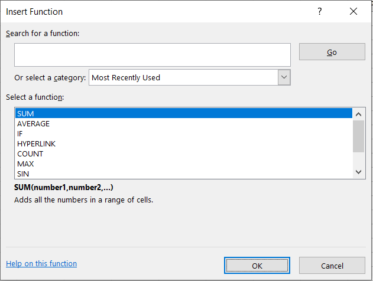

    Then users can select parameters, either by entering in the form below, or select them directly from the spreadsheet.

    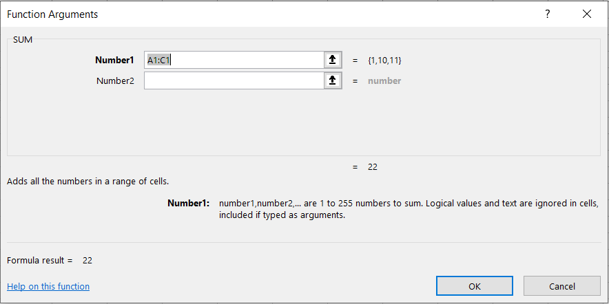

    This UI requires users to interact with the spreadsheet to select the parameters of the function. However, the spreadsheet is hidden by the popup wizard, so the user might need to navigate around to select the parameter cells. The name of the columns are presented as a combination of X and Y coordinates, which does not really apply to the table views of the Trace Extension, where we have a meaningful name for each column. The overall UX is clunky and out-dated.

2. Microsoft Power BI

    Microsoft Power BI has a different approach to add custom/calculated columns.

    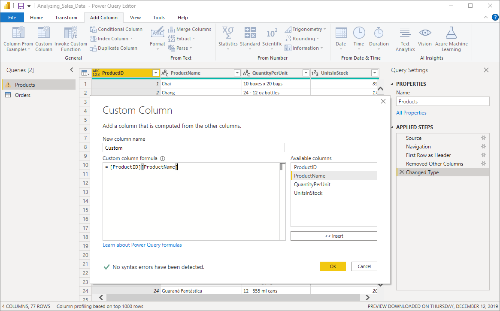

    It divides the UI into 2 main areas:
    - On the left, a text area for entering the formula for the custom column [1].
    - On the right, a list of available columns [2].

    When the user selects a column name from [2], they are added to [1] within square brackets.

    This UI is better than Excel's because it provides the column names so that users can simply add them to the formula. Also, the formula is also visualized for the users. This is the example where the proposed prototyped will heavily based on.

3. Google

    Google also uses a layout similar to Microsoft Power BI.

    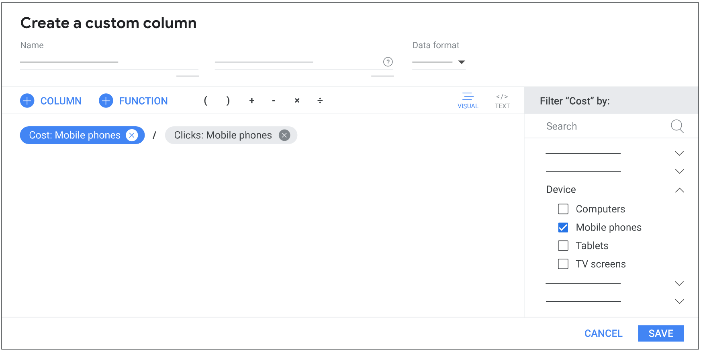

    Instead of the list of available columns (compared to Power BI), we have some filters. This is not relevant to the Trace Extension. The columns are displayed differently with a specialized UI element instead of using square brackets.

4. Plateau

    Plateau also implements a similar layout to Microsoft Power BI.

    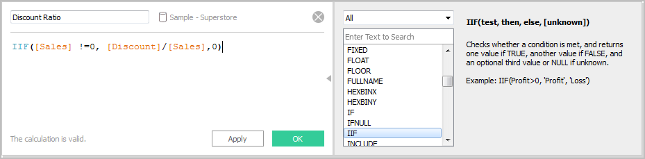

    It also uses square brackets to indicate the columns used in formulas. However, instead of the list of column names on the right, the UI displays a list of functions that can be used.

## Decision

### Decisions

Combining the requirements and constraints of this ADR, the UI from Power BI is the most suitable for the Trace Extension. Since we are not planning to support aggregate functions, this eliminates Plateau and Google's UI that display the filters and functions. However, since Plateau, Google and Power BI use the same layout for its element, we will try to implement the same layout.

#### Manage columns UI

First, we need a view where users can manage all the columns in a table view. To open such view, we can add a new option in the hamburger menu that already exists in every table view.

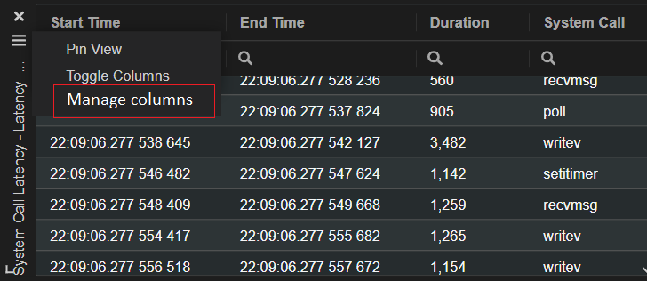

Choosing the `Manage column` option will open the `Manage columns  view`.

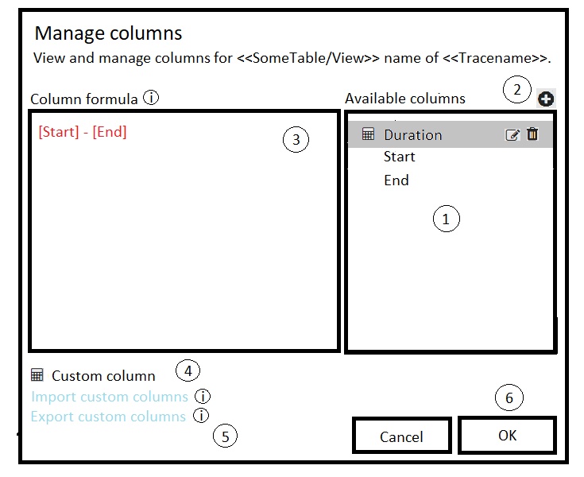

1: The `available columns` section lists the columns that are currently being displayed for a certain table. Programmatic columns are indicated by a calculator icon (see [4]). Only custom columns can be edited, or deleted (using the corresponding icons).

2: The plus icon allows user to [add new custom columns](#new-custom-column-view).

3: The column formula section displays the formula of a custom column. Mathematical operators are entered using the keyboard. Columns are indicated using square brackets. Formulas of default columns should be just the column name in square brackets.

4: A legend to help user understand the icon indicating the custom columns.

5: Links to [import](#importing-columns) and [export](#exporting-columns) custom columns.

6: Confirm/Cancel button.

#### New custom column view

After clicking on the add new column button in the [manage columns view](#manage-columns-ui), the add new column view will open.

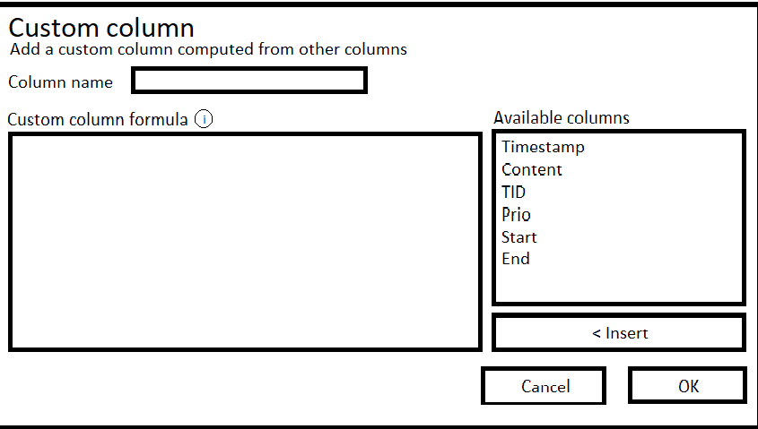

The following section describes the action flow of the user for adding a new custom column.

1. First the user enters the column name.

    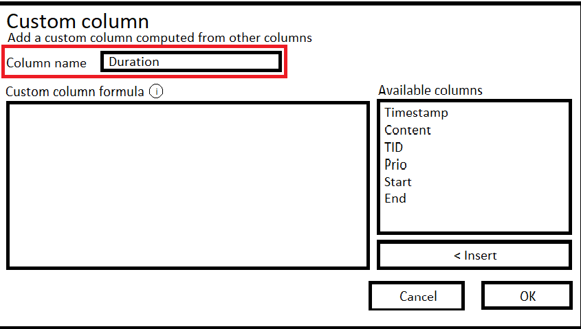

2. Next the user can select a column from the available columns list by double clicking or using the insert button.

    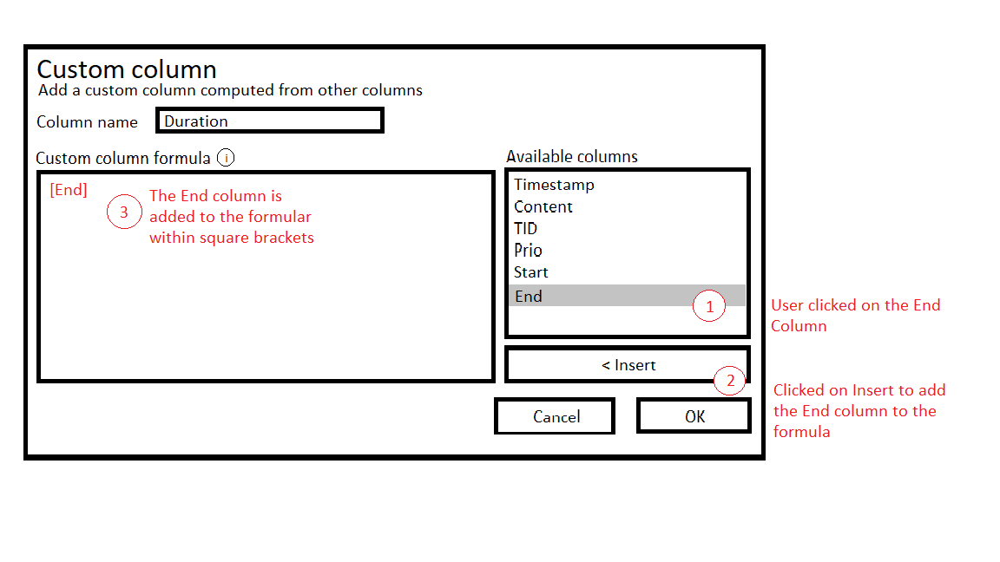

3. Operators can then be entered using the keyboard, including brackets to group expressions.

    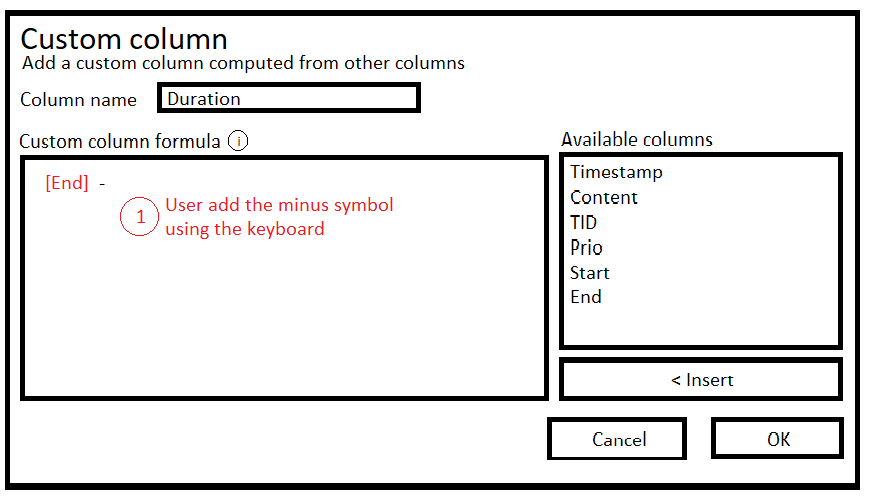

4. Then, the user selects the next parameter of the formula.

    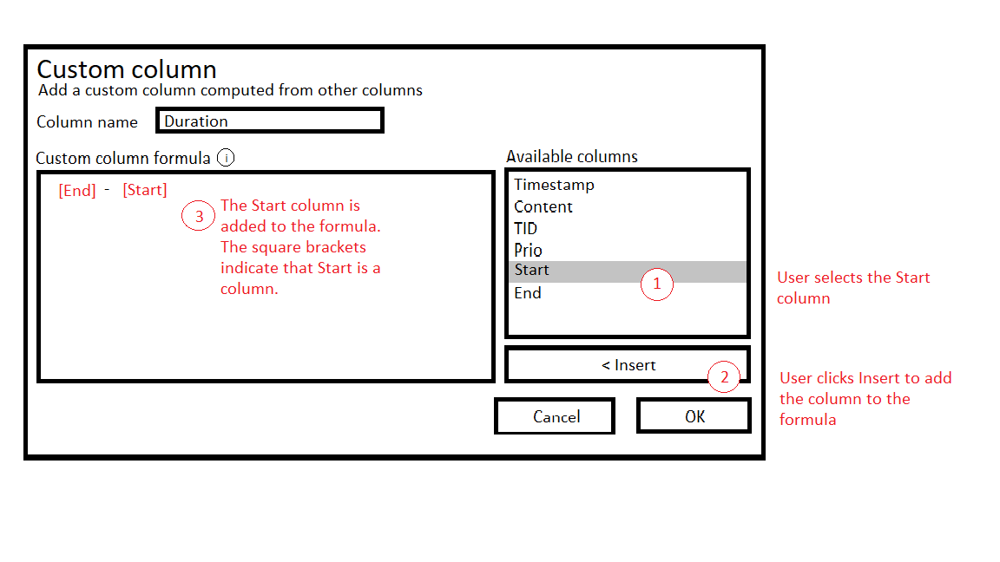

5. Finally, the user selects OK, or presses Enter to add the new column to the view. A new column is then added to the table/view. The custom column can be removed directly from the table using the delete icon (or garbage bin icon).

    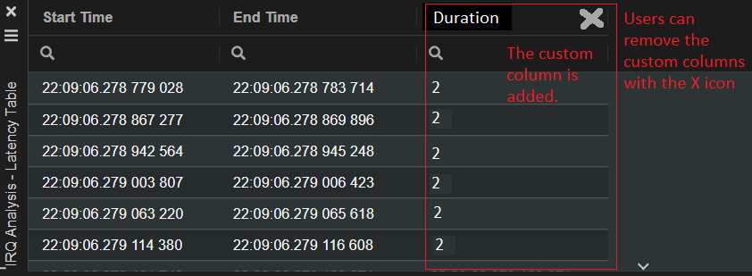

6. If there is an error while parsing the formula, an error message will be displayed under the formula text area.

    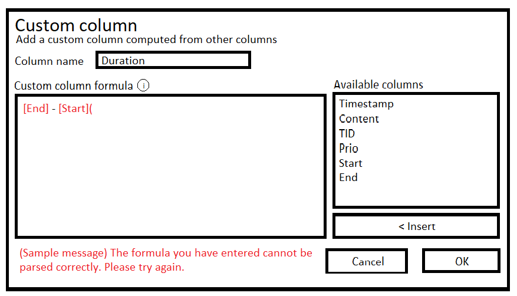

#### Editing an existing custom column

Only custom columns are editable by clicking on the `Edit` icon next to the column name in the [Manage columns view](#manage-columns-ui). The edit column view is similar to the add new column view, and the allowable actions are the same. However, users have the options to delete a column from here by using the `Delete` button at the bottom right of the view.

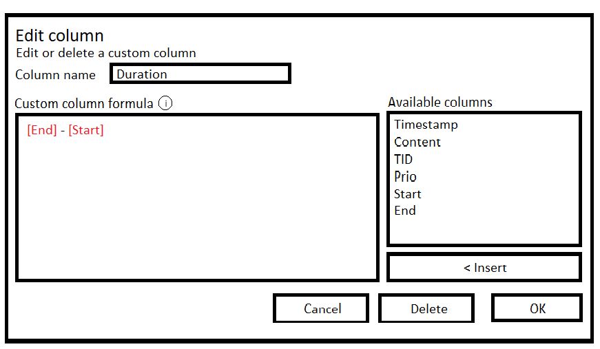

#### Importing columns

To import columns, simply click on the `Import column` link in the [Manage Column view](#manage-columns-ui). The following view is then presented.

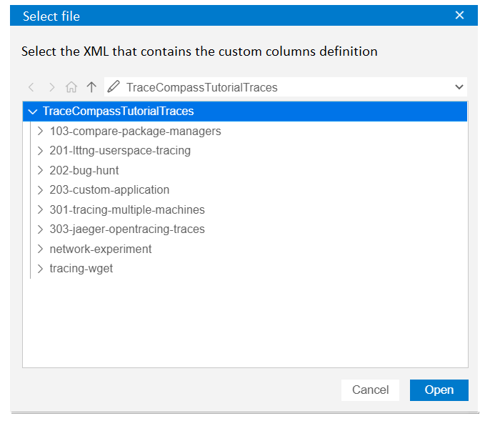

For now, we assume that we will use XML to import and export the column data, but this can change with any future iteration. The user can select any valid XML file that contains the column data. After selecting the file, the import column view will be shown.
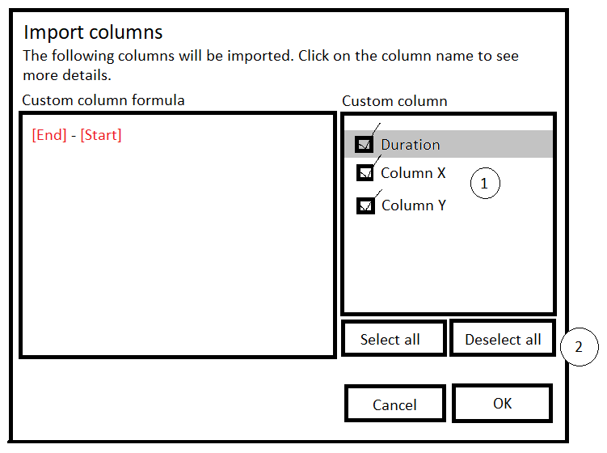
Similar to the `Manage column views`, there is a text area for viewing the column formulas. On the right, there is a checklist of columns to be imported. Users can click on the column name to view its formula and use the checkboxes to decide which column will be imported. Columns are not editable here.

There will also be buttons for users to select all, or deselect all columns. By default all columns will be selected for importing.

#### Exporting columns

To export columns, simply click on the `Export column` link in the [Manage Column view](#manage-columns-ui). The following view is then presented.

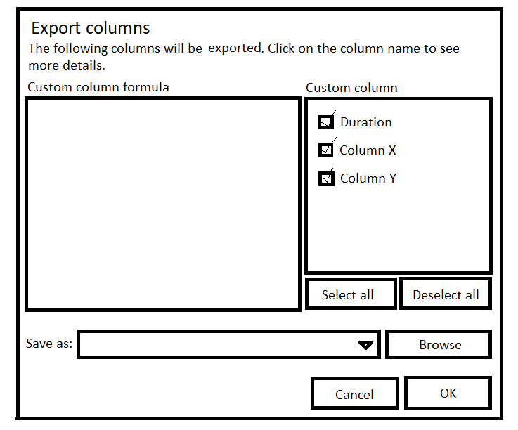

Similar to the importing column view, we have a custom formula display element and a checklist of columns to export. Allowable user actions are also similar. Users can select columns to export from the checklist, then the file name and location of the exported file using the browse button. Finally, the user can click on the OK button to complete exporting the custom columns. A new XML file (for now) will be saved in the selected location.

## Consequences

The new UI/UX for custom columns will allow users to create columns that are calculated from other columns, helping users extract interesting and relevant information quickly, thus improving product quality, user experience and efficiency overall.
