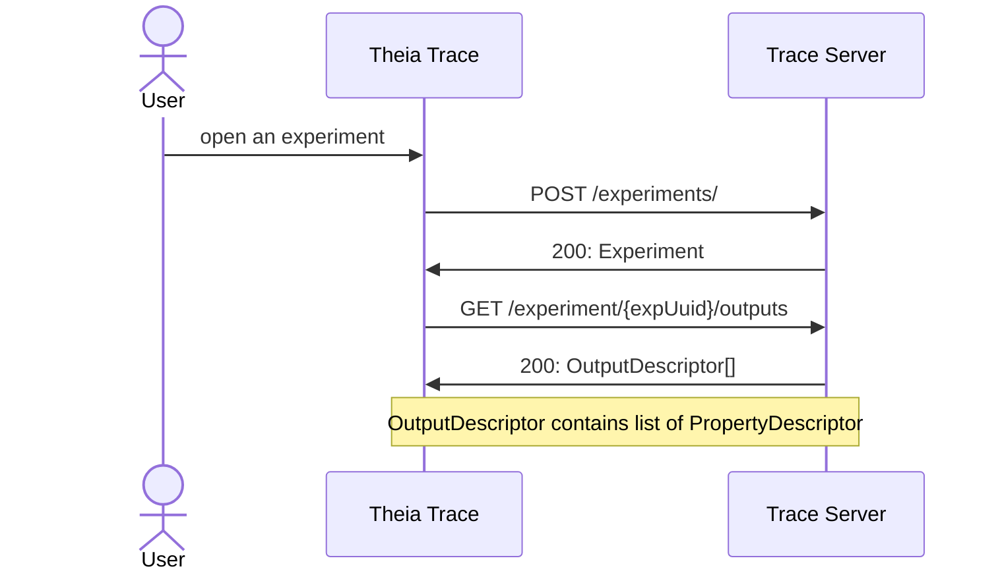
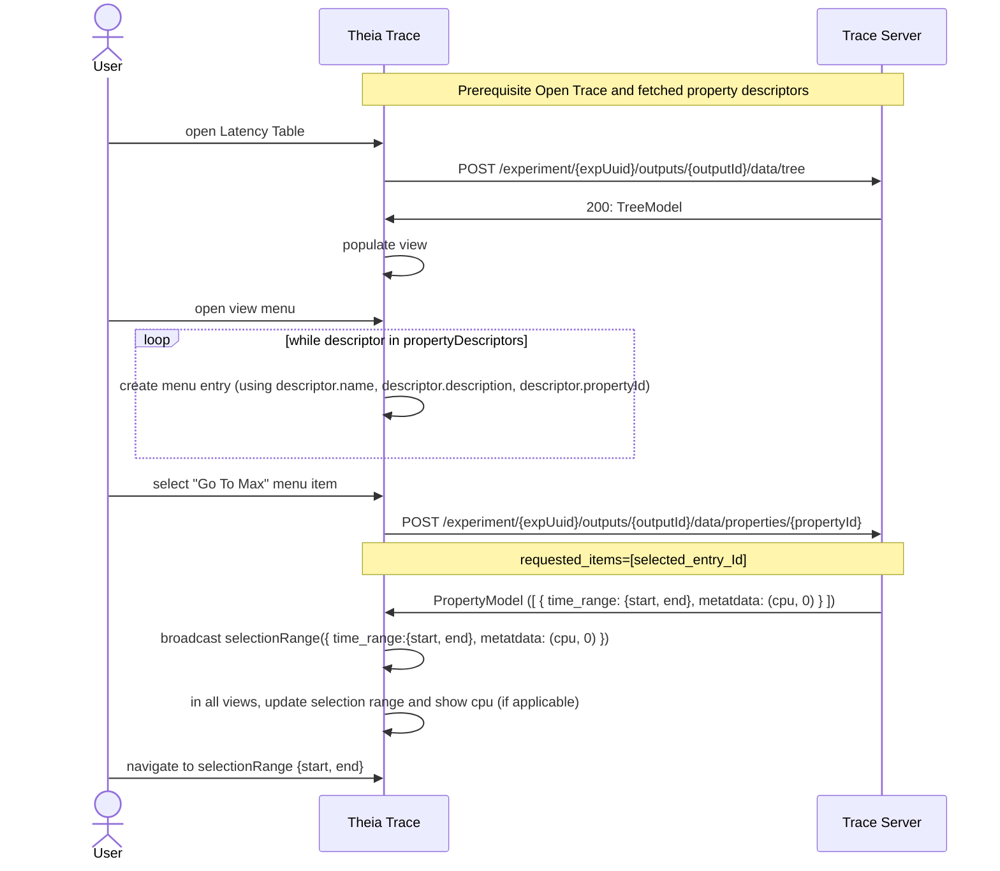
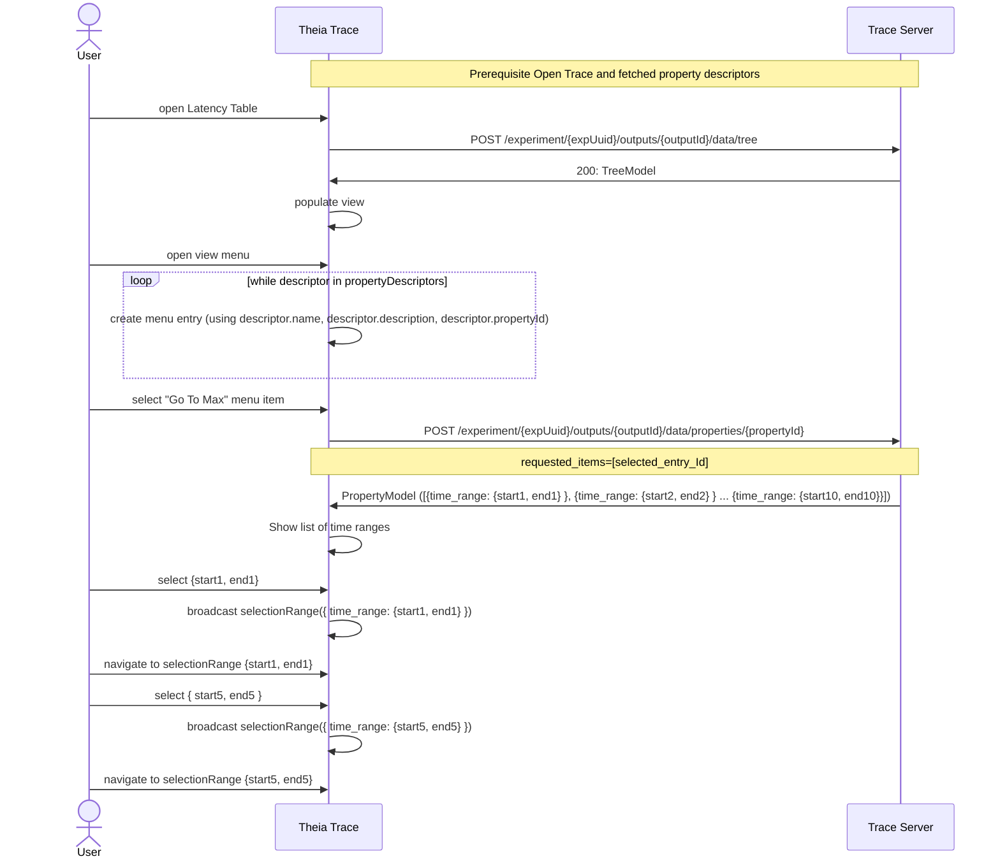
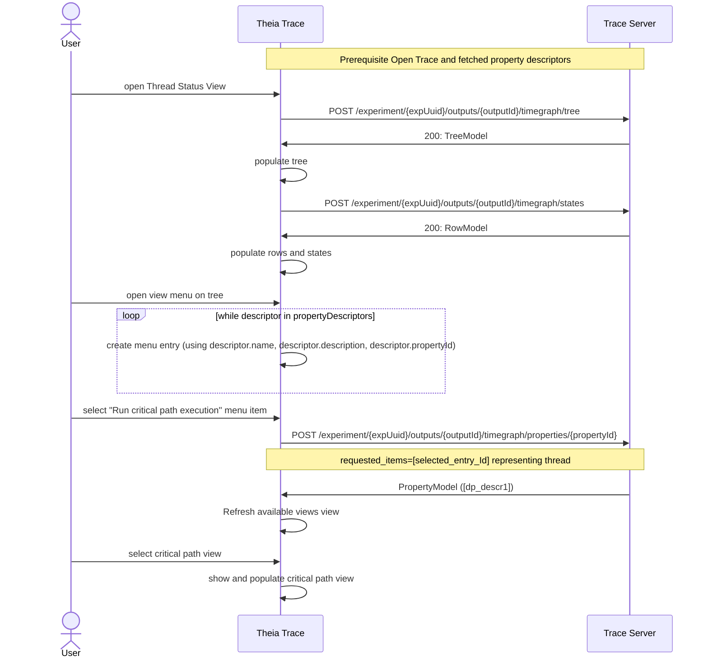
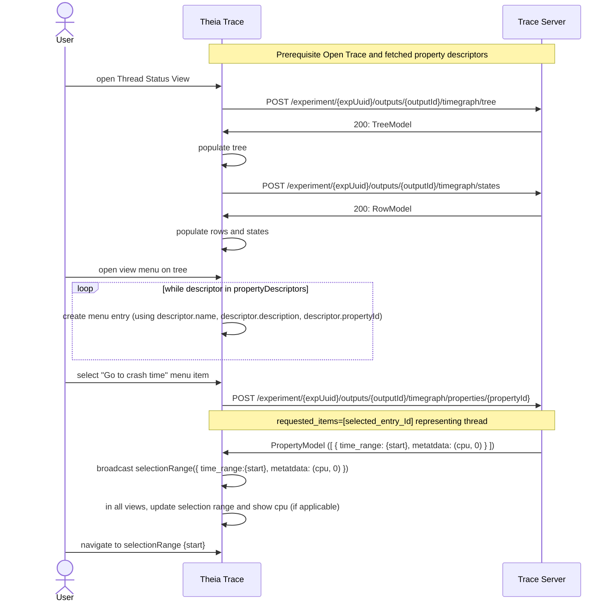
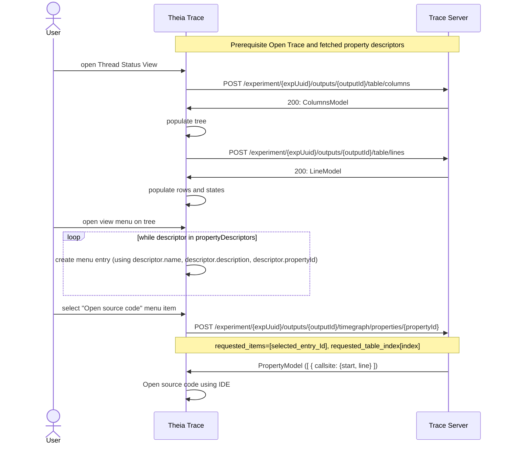

# 7. Queryable properties

Date: 2023-01-30

## Status

New

## Context

User of the trace-viewer application are often interested in additional information from the data provider. For example, the Trace Compass latency statistics views has columns about minimum and maximum duration and user would like to navigate to the time range where this maximum occurred. The front-end that uses the Trace Server Protocol doesn't know about what data it displaying. It only knows about different graph types. For the latency views it's a table tree with columns, but it doesn't know that there is a minimum column or maximum column, nor it knows where in the trace it occurred.

The Trace Server Protocol (TSP) needs to be augmented to provide such type of data, so that the front-end can provide controls for the user to apply actions in the front-end like select and/or navigate to a given time range, open source code or show a new view using a new custom data provider. These properties are meant to be optional and on-demand, for specific select elements in the views. They should be quick queries and the returned data structures should have limited purpose. They are not meant to query all elements in the view. If that is required, new data providers should be created.

This feature is complementary to the tooltip endpoint for data providers which provides some additional, static details on an UI element. 

### Use cases

- Get min/max time range per entry
- Get the N longest executions per thread
- Get crash time (other details like CPU, process, thread)
- Get most utilized frame (time range)
- Get source location and open source code file
- Run critical path analysis and create a data provider descriptor

The challange is to handshake these properties or capabilites between front-end (clients) and server over an domain-agnostic protocol.

### Data Structure

Augment the `DataProviderDescriptor` data structure with information about queryable properties.

```java
    /*
        PropertyDescriptor 
        {
            name:        string
            description: string
            id:          string
            queryParams: {
                            requested_items:          optional, single entry ID of interest
                            requested_element:        optional, single element of interest (state or arrow or link, state, duration)
                            requested_time_range:     optional, time range the query is for, or full trace if ommitted
                            requested_table_index:    optional, index of event
                        }
            propertyModelType: 
                        enum {
                            time_ranges,
                            dp_descriptors,
                            callsites
                        }
        }                

        Where:
            queryParams can be any query paramerter that is allowed for a given data provider type.

            Returned PropertyModel determined by propertyModelType:

                time_ranges:
                        {   
                            array of {
                                time_range: {start, end}, where end is optional for single a timestamp
                                metadata: optional, map of key-value pairs to identify cpu, thread etc.
                            }
                        }
                dp_descriptors:
                        {   
                            array of {
                                dp_descriptor: OutputDescritpor
                            }
                        }
                callsites:
                        {   
                            array of {
                                callsite: {file, line}
                        }
     */
```

### Suggested default behaviours

`Single time ranges (or time)`

- "Select" or "Select and Reveal" time

`Multiple time ranges`

- Display list of time ranges (e.g. dialog, overlay list)
- User can click on time range
  - "Select" or "Select and Reveal"

`List of data providers`

- Refresh `Available Views` view with new descriptors
- User can select new descripter to open view

`List of callsites`

- Display list of callsites (e.g. dialog, overlay list)
- User can click on a callsite and source code file will be opened using IDE's capabilities

### Example Sequence Diagram

Prerequiste `Open Trace and fetched property descriptors` for all diagrams:



#### Go To Max

The following feature exists in Eclipse Trace Compass for all latency statistics tables. It provides the possibility to navigate to the time range where the maximum latency occured. The metadata give some additional information that can be used in the front-end to identify UI elements (not available in Eclipse Trace Compass).



#### Get 10 longest executions

This features could be used on latency tables to provide the top 10 latencies for a function.



#### Run critical path analsis

This feateure exists in Eclipse Trace Compass and its `Control Flow view` (i.e. `Thread Status view`). Selecing a row in the tree which represents a thread and using the new menu item, can be used to create a `Critical Path Data provider` that can be opened in the front-end.



#### Go To crash

The following feature allows data providers to provide the time when a crash happened on a given CPU.



#### Open source code

Some UI elements, e.g. trace event in `Events Table` or state in `Thread Status` view, it can provide the source file and the line number where that event happened. Use this to allow provide callsite information and use the IDE's capability to open source files.



## Decision

Implement this feature for the `Go to min/max` for Latency views first which represents an example time navigation use case. Make it the TSP definition extendible so that the other use cases can be added gradually.

## Consequences

If this proposal is implemented, the tool becomes more interactive and it will provide a better UX. Users can retrieve more details from the backend in order to navigate inside the trace and find relevant, interesting time ranges, to look-up source code or create custom data providers.

If this proposal is not implemented, the tool will remain a pure data visualization tool without domain specific customizations.
