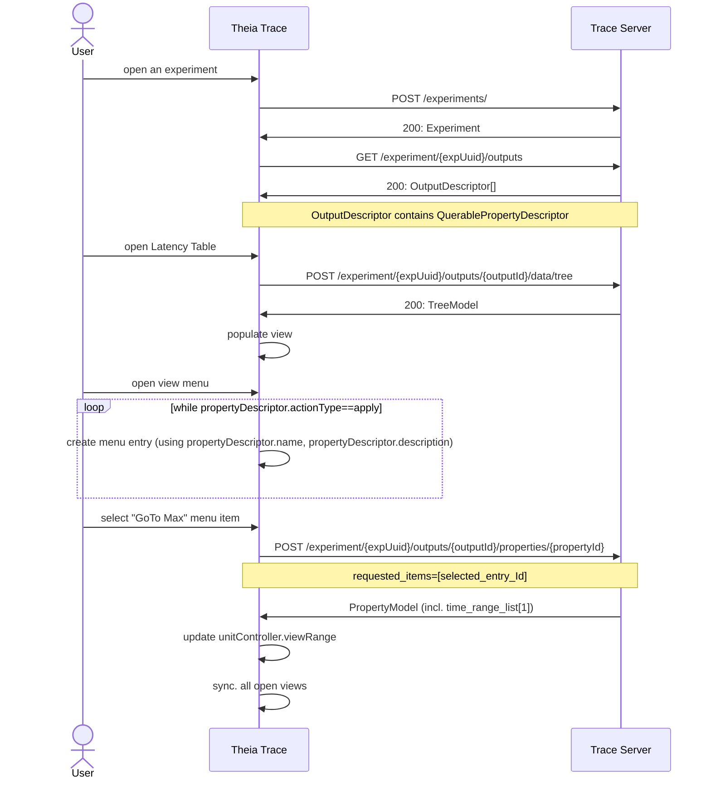

# 7. Queryable properties

Date: 2022-10-13

## Status

New

## Context

User of the trace-viewer application are often interested in additional information from the data provider. For example, the Trace Compass latency statistics views has columns about minimum and maximum duration and user would like to navigate to the time range where this maximum occurred. The front-end that uses the Trace Server Protocol doesn't know about what data it displaying. It only knows about different graph types. For the latency views it's a table tree with columns, but it doesn't know that there is a minimum column or maximum column, nor it knows where in the trace it occurred.

The Trace Server Protocol (TSP) needs to be augmented to provide such type of data, so that the front-end can provide controls for the user to navigate.

**Use cases:**

- GoTo min/max per entry or all
- Get longest executions per entry or all
- Get the N longest execution per thread
- Get Crash details (time and other details like CPU)
- GoTo most utilized frame
- Get the N most utilised spans in order
- Run critical path analysis (returns a data provider descriptor)

The challange is to handshake these properties or capabilites between front-end (clients) and server over an domain-agnostic protocol.

### Data Structure

Augment the `DataProviderDescriptor` data structure with information about queryable properties.

```java
    /*
     * QuerablePropertyDescriptor {
     *  name:        string
     *  description: string
     *  id:          string
     *  actionType:  apply, display
     *  inputType:   entry, custom (e.g. thread name, or filter string?)
     *  queryParams: {
     *                 requested_items:          optional, array of entry ids if inputType is entry, if omitted all
     *                 requested_time_range:     optional, of not passed full trace
     *                 requested_custom_strings: optional, provide custom strings (filter string?)
     *               }
     *  returnType:  one of:
     *                   - array of { id: entryId, if inputType=entry
     *                              name: string used if inputType=custom
     *                              one of:
     *                                time_range_list: [{start1, end1}, ..., {startN, endN}]
     *                                timestamp_list: [time1, time2..., timeN]
     *                                // Note if actionType=apply only use the first one, if list.size > 0
     *                            }
     *                   - new data provider descriptor
     */

    /*
     * Notes: for actionType displayed, the data should be shown and the user should
     * have a menu either select (highlight) or (zoom into) or (move to).
     */
```

### Example Sequence Diagram (for GoTo Max)



## Decision

The change that we're proposing or have agreed to implement.

## Consequences

What becomes easier or more difficult to do and any risks introduced by the change that will need to be mitigated.
