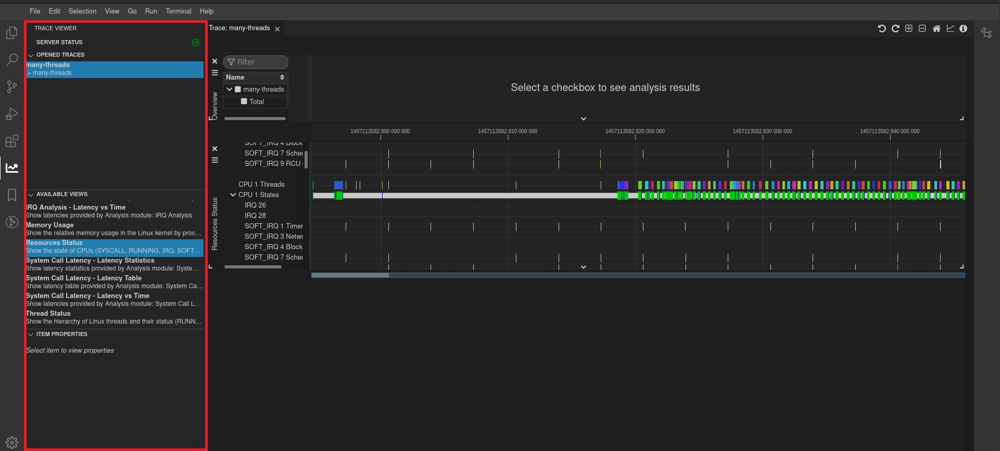
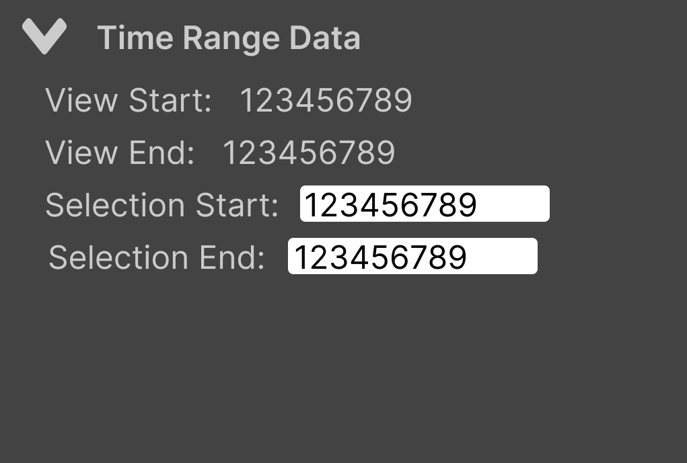
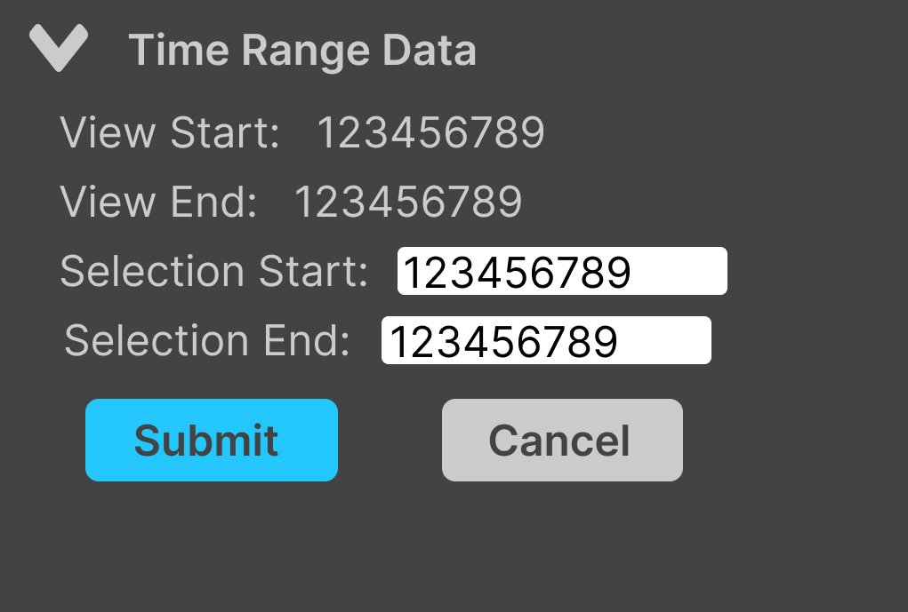
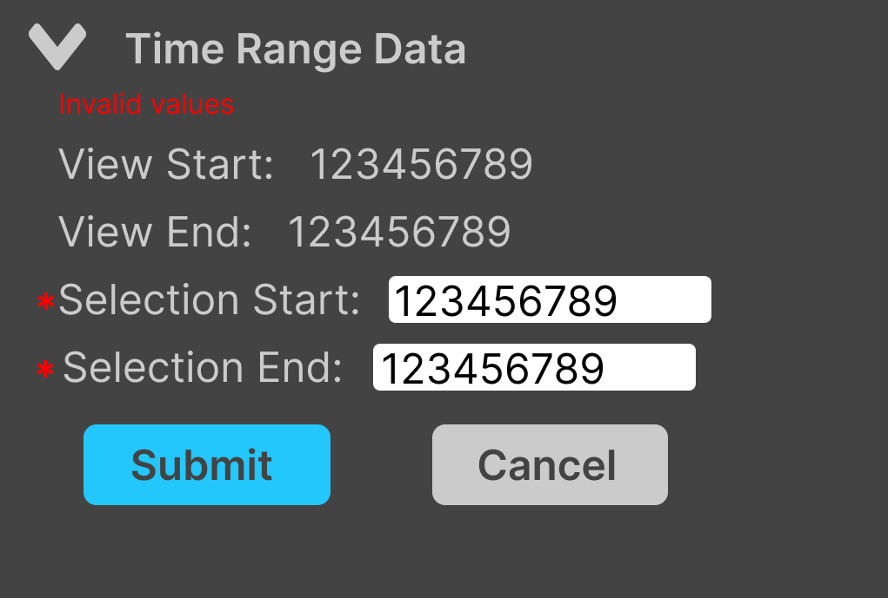

# 8. Time Range Data Widget

Date: 2023-1-10

## Status

ACCEPTED

## Context

There has been a request for the ability for users to be able to select part of a trace by copy/pasting timestamp data.  An attempt was made to implement this feature, but a consensus could not be reached on the UI/UX.  Design needs to be agreed upon before any further implementation.

The proposed design is subject to change based on feedback.

### Proposed UX Design

#### UX Flow

A "Time Range Data" widget will be added to the left panel.

The widget will display: View Start, View End, Selection Start, Selection End.

Clicking on the Selection Start / End input box displays a Submit and Cancel button.  Only the selection start/end will be editable.

If the selected time is invalid, the user will be notified onSubmit with a red asterisk and warning message at the top.  Submit and Cancel buttons will remain visible.

If the selected time is valid, the selection range will be set and the widget will return to it's initial state.

#### UX Miscellaneous Behaviors
* The view range will not change when the selection range is changed.  This includes panning and zooming.
* The time will be displayed in absolute time as nanoseconds, since that is the format users timestamp data will be.

### Architecture Design

In a recent PR the "Item Properties Widget" was refactored to be more compatible with future VSCode implementations.  The design of this widget should follow the new architecture.

[Created a widget for properties view in react-components #892](https://github.com/eclipse-cdt-cloud/theia-trace-extension/pull/892/files)

## Decision

This has been approved as outlined above.

## Consequences

Use of left-side panel real estate.
