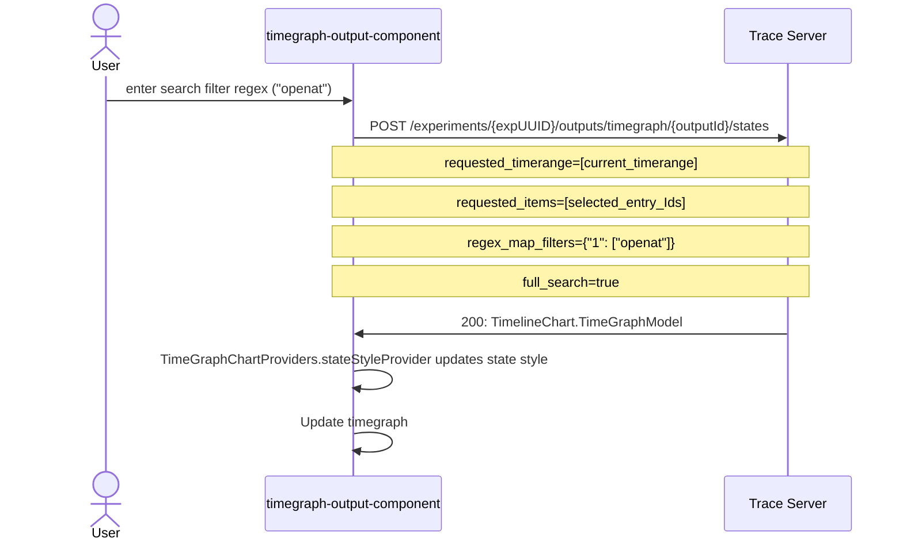

# 9. Tsp updates for search functionality in time-graph views

Date: 2023-02-03

## Status

Accepted

## Context

We want to support search and filter expressions for time graph views in Trace Extension. In Trace Compass, time graph views allow users to pull up a search bar that is used for searching/filtering of events. A detailed description of searching/filtering of time graph views in Trace Compass can be found [here][trace-compass-user-guide].

This ADR is intended to discuss the changes needed in the [Trace Server Protocol (TSP)][tsp-api] specification and review the UI mockups.

Currently, the trace-server-protocol documentation for [getStates][tsp-states-documentation] does not involve any query parameters for searching or filtering states. The `/states` endpoint takes in the parameters `requested_timerange` and `requested_items`. The following is an example:
```
{
  "parameters": {
    "requested_timerange": {
      "start": 111111111,
      "end": 222222222,
      "nbTimes": 1920
    },
    "requested_items": [
      1,
      2
    ]
  }
}
```
- The array `requested_timerange` is the explicit array of requested sample times. The array `requested_items` is the list of entryId's being requested.

But it is possible to augment the request body by adding `regex_map_filters` and `full_search`. These parameters are currently accepted by the time graph data provider - and they can be used to support search/filter expressions. Here's an example where we can use these parameters to search for states with the label "openat":
```
{
  "parameters": {
    "requested_timerange": {
      "start": 111111111,
      "end": 222222222,
      "nbTimes": 1920
    },
    "requested_items": [
      1,
      2
    ],
    "regex_map_filters": {1: ["openat"]},
    "full_search": true
  }
}
```
-   `regex_map_filters` is an array with requests for searching. The  key  of  this  map  can  be \"1\" (means  DIMMED) or \"4\" (means  EXCLUDED) and  the  value  is  an  array  of  the  desired  search  query (e.g. {\"1\": [\"openat\", \"duration>10ms\"]})". The time event filtering uses its own **domain-specific language (DSL)**, which supports various operators and filter expressions. The definition of regexes is outside the scope of this ADR.
-  The `full_search` key is an optional parameter that enables the full_seach (deep search) or not. 
   - If true then the data provider is expected to perform a full_search of elements that occur between the usual elements found at the requested times (e.g. in gaps).  If any element matches the specified regex filter, at least one such  matching element per gap should be returned. It is not expected to return  all matching elements found in a single gap, for performance reasons.  
   - On the client side when we try to perform a graph search we could first do a normal non-full_search query for all the visible rows, in order to quickly show something to the user. This would be followed by a full_search in the background. Because this process can be very slow, we could do it one row at a time and update the graph incrementally as each row's fine-grained result comes back. There might be better ways to combine non-full_search with full_search, therefore the sequence of operations to get the best user experience should be in another ADR. 

Here's an example Sequence Diagram for the search request above:



I've attached a link to a prototype in trace-extension that makes use of the aforementioned parameters to  search time events in time graph views:
- [https://github.com/eclipse-cdt-cloud/theia-trace-extension/pull/886][pull-886]
- This prototype adds a search-box to the timegraph-output-component to search for events. The filter is applied and unsuccessful time events are dimmed.
- At the moment its only looking at sampled search, we will add full-search functionality in the near future.
- The search-box only takes in a single search string - we will add the ability to apply multiple filters through future patches.
- This might not be the final UI, but it gives the idea on how to achieve it.
 
Even through the current TSP can support search functionality, the use of `regex_map_filters` does not seem to be very intuitive, as a client developer would not be sure of what to pass and what the expected response should be. A suggestion is to rename `regex_map_filters` to `filter_query_parameters`. `filter_query_parameters` takes a `filter_expressions_map`, which contains the search expressions as shown in `regex_map_filters`. 

There is also some confusion with the `full_search` flag, and a suggestion is to change it to `strategy`. `strategy` would accept 2 possible values `sampled` and `deep`. The `strategy` flag is an optional parameter within `filter_query_parameters`, and if `strategy` is omitted then `sampled` search would be the default value.
The following example does the same query given above but uses `filter_query_parameters` and `strategy` instead:
```
{
  "parameters": {
    "requested_timerange": {
      "start": 111111111,
      "end": 222222222,
      "nbTimes": 1920
    },
    "requested_items": [
      1,
      2
    ],
    "filter_query_parameters": {
	  "strategy": "deep",
	  "filter_expressions_map": {    
        "1": ["openat"],	   
	  }
    },
  }
}
```
Here are the following patches for implementing time graph filter capability through `filter_query_parameters`:
-   Update query parameters for `/states` in Trace Compass Incubator: [https://git.eclipse.org/r/c/tracecompass.incubator/org.eclipse.tracecompass.incubator/+/196610][filter-query-parameters-pull-states]
-   Updates to swagger documentation: [https://git.eclipse.org/r/c/tracecompass.incubator/org.eclipse.tracecompass.incubator/+/196592][filter-query-parameters-pull-swagger]
-   Updates to the TSP documentation: [https://github.com/eclipse-cdt-cloud/trace-server-protocol/pull/84][filter-query-parameters-pull-tsp]

In the previous examples we noticed that the array of search expressions takes a key value of "1” (means DIMMED) or “4” (means EXCLUDED). We should also discuss the possibility of explicitly mentioning "DIMMED" or "EXCLUDED".

We also need to take a look at the response for `/states` when we add search/filter expressions in our request. The response body would still be a list of time graph entry states for each row. Every state has a bit-mask called `tags`, which helps indicate whether it matched the search/filter expression or not. For example, if we ask for a 'search' expression the states that don't match it would be dimmed, and the `tags` will have the corresponding bit set:
```
{
   "states": [
     {
       "tags": 1,
       "start": 0,
       "style": {
         "parentKey": "string",
         "values": {
           "property1": {},
           "property2": {}
         }
       },
       "label": "string",
       "end": 0
     }
   ]
}
```
- When `tags` is set to 1 it is interpreted by the client as setting a dimmed opacity to the state. Similarly, when it is set to 4 it would be considered as being excluded. The reason for this bit mask is to minimize the amount of data transported per state. As previously mentioned, we should consider having `tags` correspond explicitly to either "DIMMED" or "EXCLUDED", although this might cause a slight effect on the performance.

### Future Enhancements
The initial implementation on the client will pass a single filter query(string) to the back-end and apply the changes. There is no feedback if the syntax is correct. However, there is a possibility to create **LSP (Language Server Protocol)**  in the back-end so that the front-end can use it to do syntax validation.

## Decision

The decision is to use `filter_query_parameters` and `strategy` to add search/filter expressions to the `/states` query that will return `tags` bit mask.

This would be followed by investigation into the client-side implementation, looking into the best way to combine non-full-search with full-search. This investigation would also review the UI in [https://github.com/eclipse-cdt-cloud/theia-trace-extension/pull/886][pull-886]

Once the TSP and client updates are completed we can look into the **Future Enhancements** (Syntax validation through LSP).

## Consequences

### Easier to do

Enhance feature capabilities of time graph views by allowing users to look for specific entries.

### More difficult

This ADR is only concerned with the TSP specification since the data provider implementation already exists. Therefore, it would not seem to add any particular difficulties.

### Risks introduced

No forseeable risks seen with this change.

[pull-886]: (https://github.com/eclipse-cdt-cloud/theia-trace-extension/pull/886)
[trace-compass-user-guide]: (https://archive.eclipse.org/tracecompass/doc/stable/org.eclipse.tracecompass.doc.user/Trace-Compass-Main-Features.html#Filtering_Time_Events_in_Time_Graph_Views)
[tsp-api]: (https://github.com/eclipse-cdt-cloud/trace-server-protocol/blob/569aac4cc29f899012b226b37c7b349bba6f78f3/API.yaml#L459)
[tsp-states-documentation]: (https://eclipse-cdt-cloud.github.io/trace-server-protocol/#tag/TimeGraph/operation/getStates)
[filter-query-parameters-pull-states]: (https://git.eclipse.org/r/c/tracecompass.incubator/org.eclipse.tracecompass.incubator/+/196610)
[filter-query-parameters-pull-swagger]: (https://git.eclipse.org/r/c/tracecompass.incubator/org.eclipse.tracecompass.incubator/+/196592)
[filter-query-parameters-pull-tsp]: (https://github.com/eclipse-cdt-cloud/trace-server-protocol/pull/84)