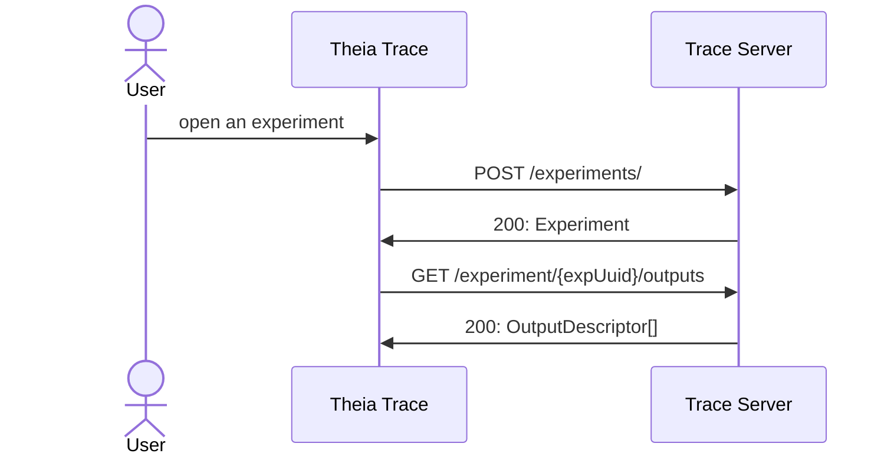
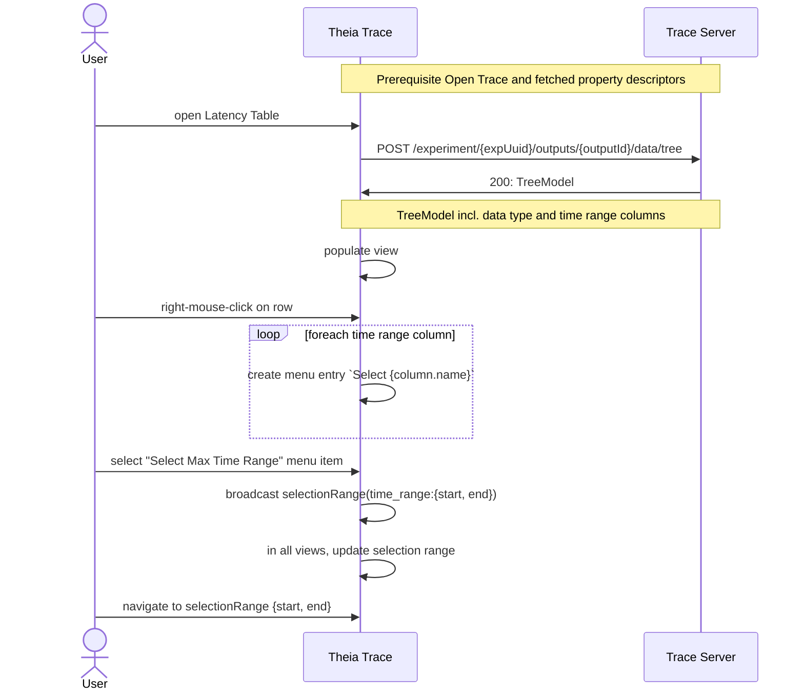

# 10. Data types in columns

Date: 2023-02-16

## Status

Accepted

## Context

Most Trace Server Protocol (TSP) data structures are currently providing already preformatted strings so that clients can just display the values as-is. This has the advantage that the clients logic can be limited. However, there are some exceptions. For example, the timestamps are provide as long values and the front-end is using for the time axis. That means timestamps have already special treatment. Because they have dedicated fields in the TSP, the client are aware that they are timestamps and certain actions can be performed. The client code uses it to synchronize the time axis, select time ranges and zoom-in/out operations.

To be able to also, provide additionals actions to select a time range the time range's start and end time need to be provided. For example, some table could provide time ranges in table columns, tool tips for the user to select. However, the client code needs to know how a time range is provided. 

This ADR introduces a `DataType` enum to describe certain data values. The values will be transported a strings and the front-end can use the data type to
determine the format to display, as well as certain user actions. For type `TIME_RANGE` the client front-end can provide actions to select, navigate and/or zoom to the time range.

### Data structure

The following `DataType` data structure proposed for the TSP is inline with the [DataType enum][data-type] of Trace Compass:

```java
public enum DataType {
    /**
     * Data represent a decimal number
     */
    NUMBER,
    /**
     * Binary data, where the size orders are powers of 2.
     */
    BINARY_NUMBER,
    /**
     * Data represent a timestamp in nanoseconds, can be negative
     */
    TIMESTAMP,
    /**
     * Data represents a duration
     */
    DURATION,
    /**
     * Data is textual data
     */
    STRING,
    /**
     * Data representing a time range of string: [start,end],
     * where `start` and `end` are timestamps in nanoseconds
     */
    TIME_RANGE;
}
```

### Use cases

The first concrete use case for the data types is the `Select min/max time range` in Trace Compass' latency views. New columns can be provided with the min and max time range. The Column descriptor will provide the `data type` and the cell value will transport the range as string `[start,end]`. To select the time range the following user actions can be implemented in the front-end:

- Make the cell entry "clickable", similar to hyperlinks
  - Advantages:
    - More discoverable for the user if column is visible on screen and not off screen
    - Addtional actions can be implemented (CTRL + click or conext-sensitive menu)
  - Disadvantages:
    - These columns need to be visible to be able to click on it
- Create a context sensitive-menu per row with menu items per `TIME_RANGE` column. The user can select one to apply the time range as selection. This is the way how Eclipse Trace Compass provides the feature.
  - Advantages:
    - Columns can be made hidden.
  - Disadvantages:
    - Context-sensitive menu is less discoverable

Notes:

- Both options can be implemented at the same time
- Action can be made configurable (e.g. `Select and navigate` instead of `Select`). Both options can co-exist.

### Example sequence Diagram

Prerequiste `Open Trace and fetched property columndescriptors` for all diagrams:



#### Select Max Time Range

All latency statistics tables in Eclipse Trace Compass support `Go to min` and `Go to max` using a context sensitive menu. This menu provides the possibility to navigate to the time range where the minimum or maximum latency occured. The sequence diagram below will show how to select the maximum time range in the theia-trace-extension. The `metadata` map in the TreeModel can give some additional information that can be used in the front-end to identify UI elements (not available in Eclipse Trace Compass).



## Future Considerations

- Replace tooltip endpoints with propertes endpoint which provides a property data structure (id, name, description, dataType, value) to populate `Items Properties` view and tooltip. Properties of type `TIME_RANGE` can then be used to implement user actions from properties view and/or tooltip window.
- Use DataType enum for `TIMESTAMP` which can be used to provide single time selection. This can be used in the `Events table` for the raw event timestamp which currently has the special `Timestamp ns` column for different behaviours.
- Augment DataType enum for data type `CALLSITE` which can be used for source code lookup
- Use DataType enum for `NUMBER`, `BINARY_NUMBER`, `DURATION`. Add support for retrieving raw data values and let front-end format.
- Use data type in XY charts as well.
- Provide time range column in segment store tables to select segments

## Decision

Implement this data type and time range columns for the `Go to min/max` action for Latency views first. It will represents an example for other time navigation use cases. Implement `option 2` for the UI (context-sensitive menu) and provide view menu option to hide time columns.

Add additional use cases gradually for the use of data type.

## Consequences

If this proposal is implemented, the trace viewer becomes more interactive and it will provide a better UX. Users can retrieve more details from the backend in order to navigate inside the trace and find relevant, interesting time ranges.

If this proposal is not implemented, the tool will remain a pure data visualization tool without domain specific customizations.

[data-type]: https://git.eclipse.org/c/tracecompass/org.eclipse.tracecompass.git/tree/tmf/org.eclipse.tracecompass.tmf.core/src/org/eclipse/tracecompass/tmf/core/dataprovider/DataType.java