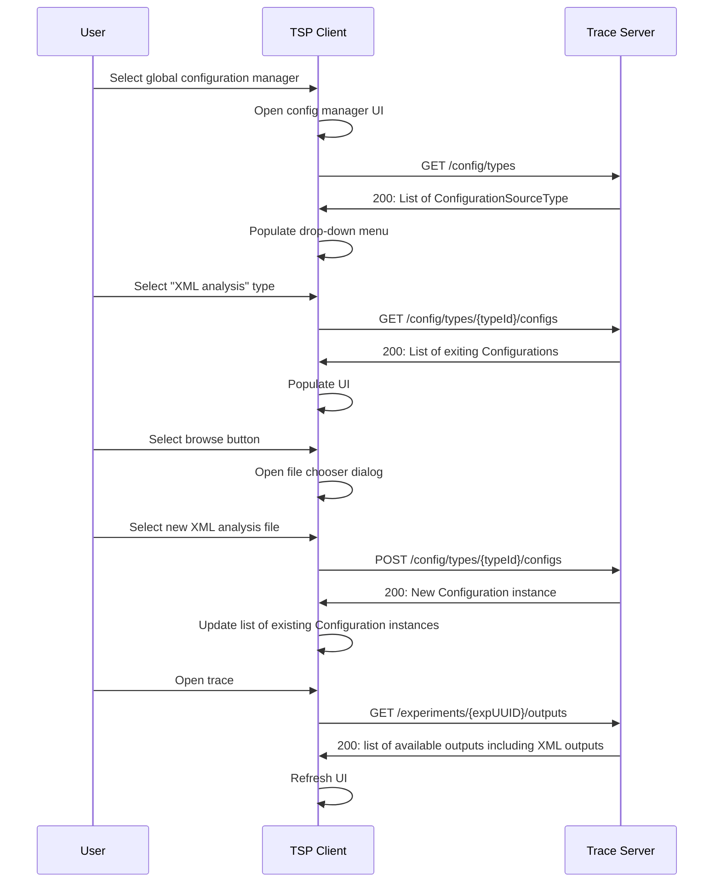
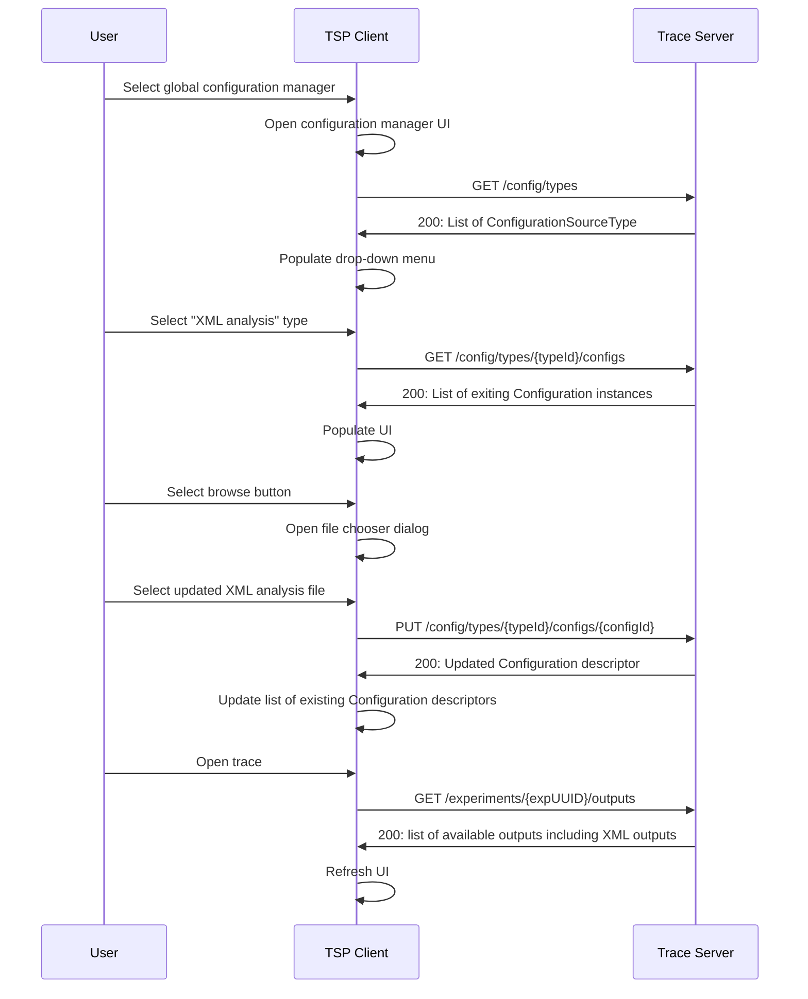
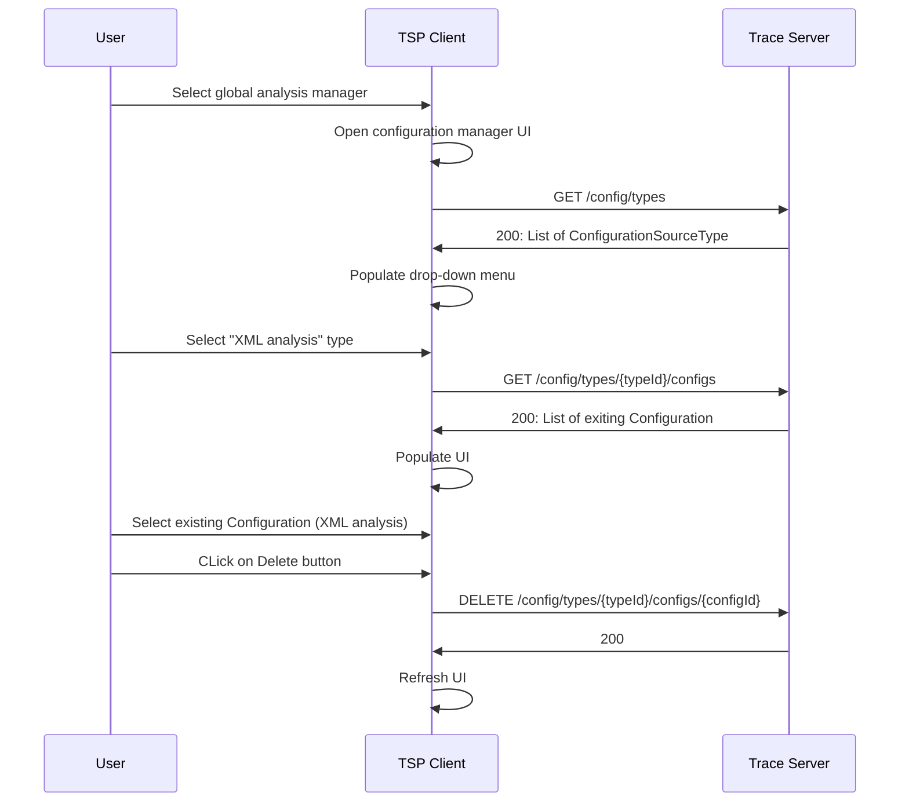
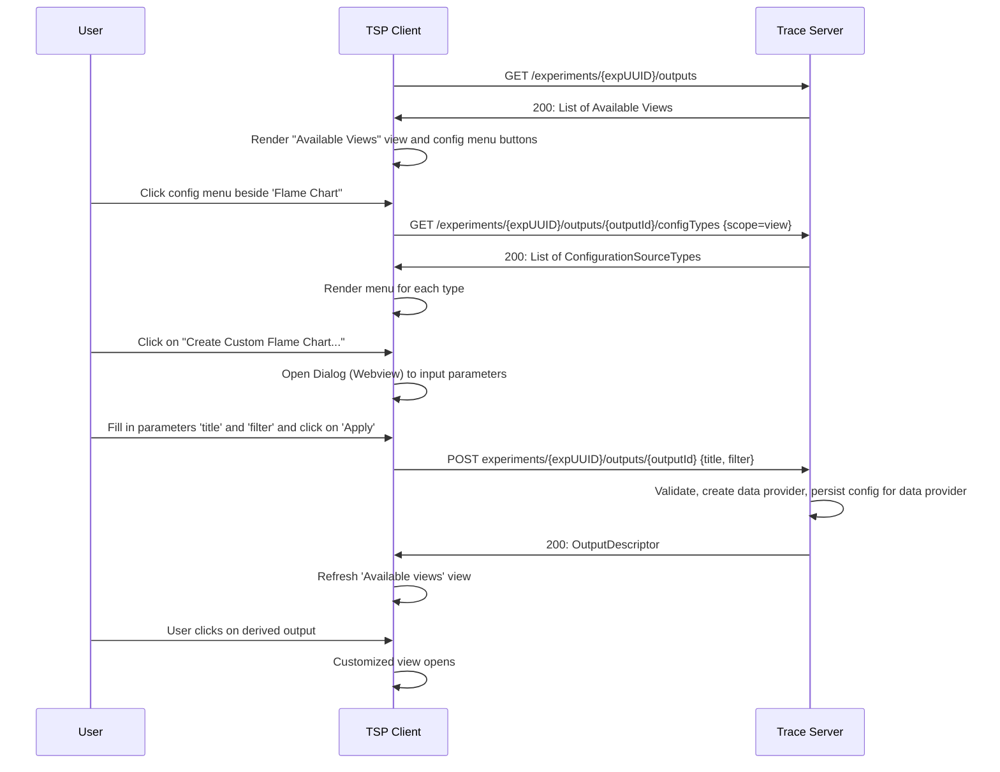
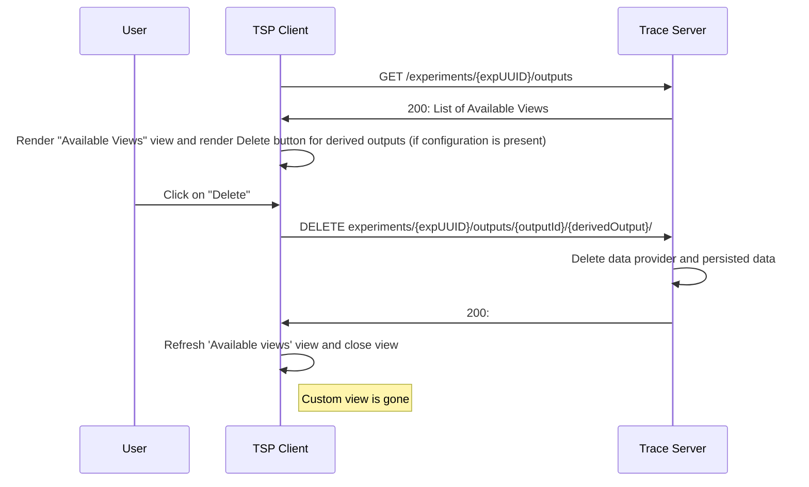

# 11. Tsp analysis api

Date: 2024-08-29

## Status

Proposed - v3

Version v1
    Initial version
Version v2
    Remove "Configuration service per experiment"
    Add "Configure customizable outputs"
Version v3
    Support of json-schema for configuration source types

## Context

The trace viewer currently is able to visualize trace data provided by a trace server over the trace server protocol (TSP). The Trace Compass server has some built-in analysis view for that. It is not possible to side-load analysis and visualization descriptions over the TSP so that end-user can provide custom views. Trace Compass supports loading of data-driven analysis and views, e.g. XML driven views or in-and-out anlysis of the Trace Compass incubator project. The Eclispe-based Trace Compass application has UI primitives to load e.g. XML files or configure custom analysis (InAndOut analysis). While the Trace Compass server has the capablility to understand these defintions, there is no way to side-load this definition over the TSP. This ADR will propose a configuration service within the TSP to facilitate these custom analysis. The proposed configuration service can also be used to configure other server specific customizations, e.g. custom trace parsers.

The ADR has been modified from its orignal version to remove experiment configuring service for loading customizations per experiment. Instead new chapters were added for customizing analysis over the TSP. With this it will be possible to provide parameters for data providers that can be customized. The server will indicate which data provider can be customized and what parameters it needs. New endpoints will provide users ways to create and delete custom outputs.

Note that `data provider` and `output` below are used interexchangably, however `output` is used in all data structures and endpoints.

### Global configuration service

An analysis service for managing global configurations will be introduced. Global in this context means that the configuration definitions will be handled on the application level. 

    GET /config/types
            returns a list of configuration source types: typeId, name, description, scope, expected parameter descriptors (e.g. "path" for file path)
    GET /config/types/{typeId}
            returns a single configuration source type for given typeId: typeId, name, description, scope, expected parameter descriptors (e.g. "path" for file path)
    GET /config/types/{typeId}/configs
        returns a list of configuration instances for a given typeId
    POST /config/types/{typeId}/configs
        Upload an configuration definition for given typeId
        Returns a new configuration descriptor with unique configuration ID
    PUT /config/types/{typeId}/configs/{configId}
        Update a configuration
    GET /config/types/{typeId}/configs/{configId}
        Returns the configuration descriptor for given configId and typeId
    DELETE /config/types/{typeId}/configs/{configId}
        Delete a configuration instance

#### Configuration source type descriptor

The configuration source type descriptor describes the type of external configuration. Different types have different syntax and hence back-end implementation. This descriptor is used to distinquish the different external configurations. The trace server implementation will provide the list of type descriptors on client requests.
```javascript
ConfigurationSourceType {
    name: string,
    description: string,
    id: string,
    scope: string,
    parameterDescriptors?: ConfigurationParameterDescriptor[],
    schema?: object
}
```

Where:

- `name`: Name of the configuration source type. Can be shown to the end-user.
- `description`: The description of the configuration source type. Can be shown to the end-user.
- `id`: Unique id of the configuration source type. Used in the application to distinquish configuration source types
- `scope:` `experiment` for configuration source types per experiment or `global` for all experiments
- `parameterDescriptors`: A list of descriptors that describe the parameters that the front-end needs to provide with corresponding values. For example, use "path" for file path. Use this instead of `schema`.
- `schema`: a JSON schema object that describes the parameters that the front-end needs to provide with corresponding values. Use this for complex parameter descriptions instead of `parameterDescriptors`.

Note: One of `parameterDescriptors` and `schema` must be present.

#### Configuration parameter descriptor

The configuration parameter descriptor describes a parameter that the front-end needs to provide with corresponding values. This descriptor will help implementing a UI for the parameters. Use this for simple parameters. For complex parameter descriptions use a [json-schema](#configuration-parameter-schema) instead.

```javascript
ConfigurationParameterDescriptor {
    keyName: string,
    description: string,
    dataType: string,
    isRequired: bool
}
```

Where:

- `keyName`: Name of the key to use in the parameter map.
- `description`: The description of the configuration parameter. Can be shown to the end-user.
- `dataType`: A data type hint to the client. Helps implementing validation of values in the front-end.
- `isRequired`: A flag indicating whether parameter is required or not.

#### Configuration parameter schema

The configuration parameter schema describes parameters that the front-end needs to provide with corresponding values. This descriptor will help implementing a UI for the parameters. Use this for complex parameter descriptions use a [json-schema](#configuration-parameter-schema) and omit the list of [configuration parameter descriptors](#configuration-parameter-descriptor). The schema string has to comply with the [json-schema specification](https://json-schema.org/)

#### Configuration descriptor

The configuration descriptor describes an instance of an external configuration for a given source type. This descriptor is used to distinquish the different external configurations for a given type.

```javascript
Configuration {
    name: string,
    description: string,
    id: string,
    sourceTypeId: string
    parameters: map<string, object>
}
```

Where:
- `name`: Name of the configuration. Can be shown to the end-user.
- `description`: The description of the configuration. Can be shown to the end-user.
- `id`: Unique id of the configuration. Used in the application to distinquish the configurations
- `sourceTypeId`: ID of the configuration source type.
- `parameters`: Input parameters to be used to create configuration

#### Sequence: Create configuration instance

The following illustrates the sequence of events and messages to create an instance of an external configuration for a given type (e.g. XML analysis).



#### Sequence: Update configuration instance

The following illustrates the sequence of events and messages to update an existing instance of an external configuration for a given type (e.g. XML analysis).


Note: If traces are open, the trace server has to take care of refreshing the back-end data structures (e.g. state systems). The client also needs to refresh the UI.

#### Sequence: Delete analysis instance

The following illustrates the sequence of events and messages to delete an existing instance of an external analysis for a given type (e.g. XML analysis).



### Configure customizable outputs 

Outputs might accept input parameters that will configure the analysis used to create the output. Such customization can create new outputs or provide additional query parameters. The TSP api will allow the back-end to define configuration types for that. Each configuration type will use `CustomizationTypeSource` to define what parameters need to be provided to create a new and derived output. The derived output descriptor will store the configuration details. Derived outputs can be deleted using a DELETE operation.

    GET /experiments/{expUUID}/outputs/{outputId}/configTypes
    Returns a list of configuration source types: typeId, name, description, scope, expected parameter descriptors (e.g. "path" for file path)

    GET /experiments/{expUUID}/outputs/{outputId}/configTypes/{typeId}
    Returns a single configuration source type for given typeId: typeId, name, description, scope, expected parameter descriptors (e.g. "path" for file path)

    POST /experiments/{expUUID}/outputs/{outputId}
    Create derived output. It returns a derived output descriptor with a unique Derived Output ID. It will contain the configuration used to create to allow manual reuse, as well as, the parent output ID. The parameter must include typeId and parameters adhering to the configuration type referenced by typeId.

    DELETE /experiments/{expUUID}/outputs/{outputId}/{derivedOutputId}
    Delete a Derived Data Provider

    GET /experiments/{expUUID}/outputs/{derivedOutputId}
    Get derived output descriptor. It will contain the configuration used to create to allow manual reuse, as well as, the parent output ID

The update API proposal augments the `OutputDescriptor`, and `ConfigurationSourceType`.

**Updated or new data structures**

```javascript
    OutputDescriptor {
        id: string,
        name: string,
        description: string,
        type: string,  // provider type
        // new parameter
        parentId?: string // optional, parent Id if derived
        configuration: Configuration // optional if derived, configuration used to be created
    }
```

#### Sequence: Create new data provider

The following illustrates the sequence of events and messages to execute an action to create a derived data provider from an existing data provider. It uses an example to create a new, custom Flame Chart from an existing flame chart with parameters `title` and `filter`. The existing `Flame Chart` data provider would have a configuration source type `Custom Flame Chart`.



Notes: 
- Data provider persists input parameters (configuration) so that output is avaivable after closing of experiment or restart


Example configuration source type:

```javascript
ConfigurationSourceType {
    "name": Custom Flame Chart,
    "description": Create instance of a custom flame based on input parameters,
    "id": "custom.flame.charts.id",
    "scope": "data provider",
    "parameterDescriptors": [
        {
            "keyName": "title",
            "description": "Provide a name of custom flame chart to be shown in UI",
            "dataType": "string",
            "isRequired": "true"
        },
        {
            "keyName": "filter",
            "description": "Provide a filter string according to filter language",
            "dataType": "string",
            "isRequired": "true"
        }
    ]
}
```

Input data provider:

```javascript
OutputDescriptor {
    "id": "flamechart.id",
    "name": "Flame Chart",
    "description": "Flame Chart description",
    "type": "TIME_GRAPH"
}
```

`User input`:
```javascript
    {"title": "CPU 0-1 only", "filter": "cpu matches [0-1]"}
```

Resulting data provider:
```javascript
    OutputDescriptor {
        parentId: string, // parent ID used to create (if not present or -1 for root data providers)
        id: string,
        name: string,
        description: string,
        type: string,  // provider type
        configuration: Configuration
    }
```

Notes:
- Stored configurations need to have unique IDs. Consider generating IDs from input parameters to avoid duplicate configurations.

#### Sequence: Delete custom data provider

The following illustrates the sequence of events and messages to delete a custom data provider for an experiment.

Pre-requisite: Analysis instance created as described in [Sequence: create new data provider](#sequence-create-new-data-provider).



### Future considerations

- The proposal requires the input of the configuration be a file that needs to be provided to the trace server. This works well, however a generic front-end cannot provide a UI implementation for creating such a file with the correct syntax. Custom client extensions implementation can be implemented for that. Also, JSON forms could be used for JSON based input.

- Data provider may decide to persist input parameters (configuration) in global server-wide storage that can be managed through the [Global Configuration Service](#global-configuration-service). With this configurations can be shared between experiments and users. For that data provider can return additional actions in List of Action Descriptors for applying existing configs that had been stored in the global server-wide storage. To list or delete a persisted configuration in global server-wide storage use the global configuration source endpoint described here [Global configuration service](#global-configuration-service).

### Implementation steps

 Use configuration using file by default for external configuration. This will allow to have a generic UI implementation in `theia-trace-extension` for that. 
 The following list provides a break down in different implementation steps. This doesn't inlcude effort for the Python client.

- Configuration Service
    - TSP updates for configuration service 
    - Back-end: Configuration Service (TSP) skeleton (Done)
    - Back-end: Trace Compass Server back-end API for configuration source types (Done)
    - Back-end: Trace Compass Server back-end API for XML analysis (Done)
    - Back-end: Use Trace Compass Server back-end API in Configuration Service (Done)
    - Front-end: tsp-typescript-client updates (Done)
    - Front-end: Implement simple manager UI for files per typeID (re-usable react component)
- Data provider configuration service:
    - TSP updates for data provider configuration service
    - Back-end: Data provider configuration service (TSP) skeleton
    - Back-end: Implement support for selected use case
    - Front-end: tsp-typescript-client updates
    - Front-end: Add UI to trigger dp creation from data provider

Other use case will be implemented on a need base.

## Decision

The change that we're proposing or have agreed to implement, will be implemented.

## Consequences

### Easier to do

This will introduce new TSP endpoints and it's a completely new feature for trace viewers supporting supporting these endpoints in the front-end and server back-end. Once implemented, it will greatly enhance the feature capabilities of the whole application. It will help end-users to define their custom analysis and visualization definitions as well as other server side configurations, and allow them to get such features faster than having to write code in the server application, compile and re-deploy the server afterwards. This will reduce troubleshooting times for the end-users.

### More difficult

Having new TSP endpoints will make the TSP more complicated to use, and interested front-end / back-end implementations need to follow. A TSP will become larger and will need to be maintained.

### Risks introduced

The TSP will be bigger and more APIs need to be maintained on all levels of the client-server application.


