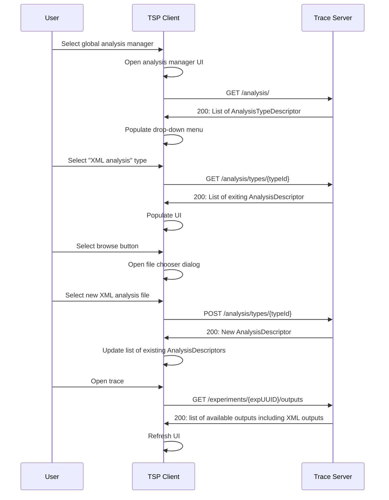
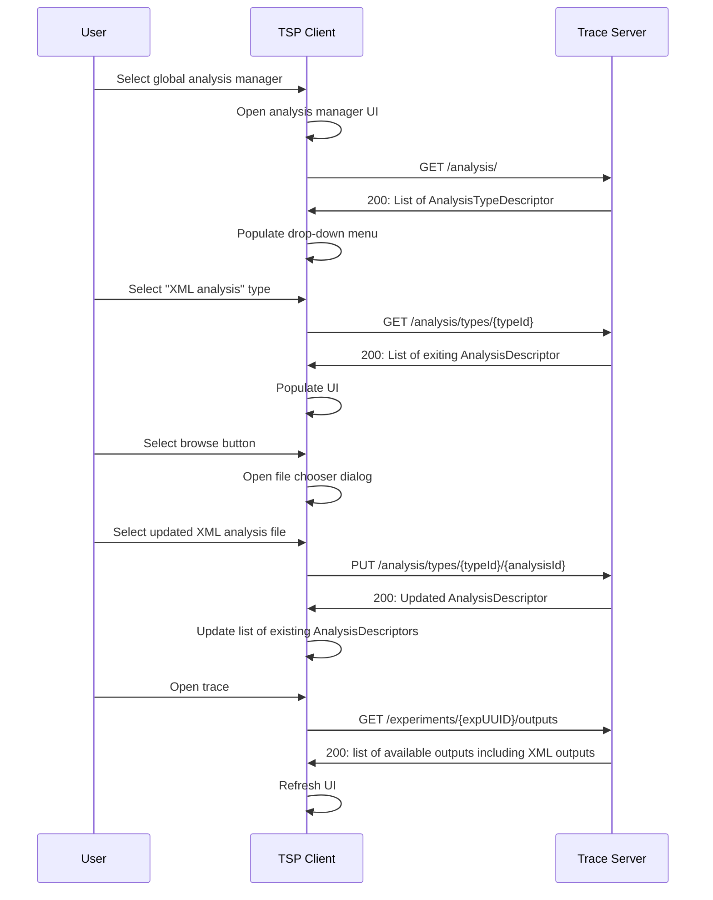
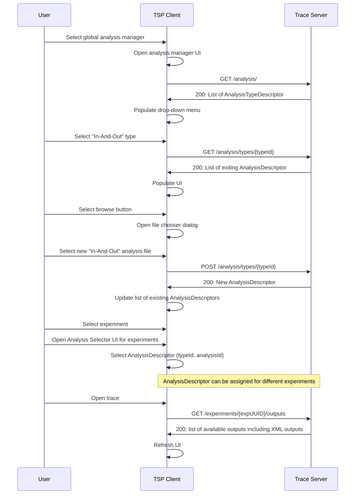
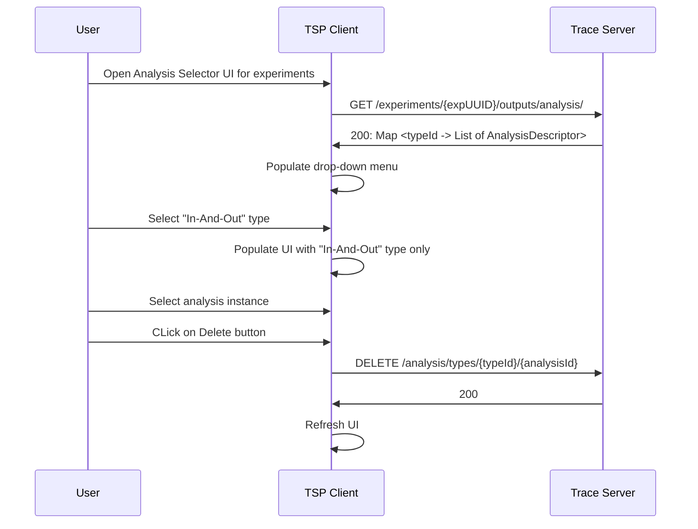

# 11. Tsp analysis api

Date: 2023-06-20

## Status

Proposed

## Context

The trace viewer currently is able to visualize trace data provided by a trace server over the trace server protocol (TSP). The Trace Compass server has some built-in analysis view for that. However, it is not possible to side-load analysis and visualization descriptions over the TSP so that end-user can provide some custom views. The Trace Compass supports loading of data-driven analysis and views, e.g. XML driven views or in-and-out anlysis of the Trace Compass incubator project. In the Eclispe-based Trace Compass application, there exists UI primitive to load e.g. XML files or configure custom analysis. While the Trace Compass server has the capablility to understand these defintions, there is no way to side-load this definition over the TSP. This ADR will propose an analysis service within the TSP to facilitate these custom analysis.

### Global analysis service

An analysis service for managing global analyses will be introduced. Global in this context means that the analysis definitions will be handled on the application level. 

    GET /analysis/
        returns a list of analysis type descriptors: typeId, name, description, expected input parameter list ("path" for file path)
    GET /analysis/types
        returns a map typeId -> list of analysis descriptor of existing analyses on server: analysisId, name, description, parameters
    GET /analysis/types/{typeId}
        returns a list of analysis descriptors for given typeId
    POST /analysis/types/{typeId}
        Upload an analysis definition for given typeId
        Returns a new analysis descriptor with unique analysisID
    PUT /analysis/types/{typeId}/{analysisId}
        Update an analysis
    GET /analysis/types/{typeId}/{analysisId}
        Returns the analysis descriptor for given analysisId
    DELETE /analysis/types/{typeId}/{analysisId}
        Delete an analysis

#### Analysis type descriptor

The analysis type descriptor describes the type of external analysis. Different types have different syntax and hence back-end implementation. This descriptor is used to distinquish the different external analysis. The trace server implementation will provide the list of type descriptors on client requests.
```javascript
AnalysisTypeDescriptor {
    name: string,
    description: string,
    id: string,
    scope: string,
    inputParameter: string[]
}
```

Where:

- `name`: Name of the analysis type. Can be shown to the end-user.
- `description`: The description of the analysis type. Can be shown to the end-user.
- `id`: Unique id of the analysis type. Used in the application to distinquish analysis types
- `scope:` `experiment` for analysis per experiment or `global` for all experiments
- `inputParameter`: A list of input parameter that the front-end needs to provide. Use "path" for file path. Only path supported as the first iteration.

#### Analysis descriptor

The analysis descriptor describes an instance of an external analysis for a given type. This descriptor is used to distinquish the different external analysis for a given type.

```javascript
AnalysisDescriptor {
    name: string,
    description: string,
    id: string,
    typeId: string
    parameters: map<string, object>
}
```

Where:
- `name`: Name of the analysis type. Can be shown to the end-user.
- `description`: The description of the analysis type. Can be shown to the end-user.
- `id`: Unique id of the analysis type. Used in the application to distinquish analysis types
- `typeId`: ID of the analysis type.
- `parameter`: A map of parameter corresponding to the `inputParameter` specified in the analysis type descriptor

#### Sequence: Create analysis instance

The following illustrates the sequence of events and messages to create an instance of an external analysis for a given type (e.g. XML analysis).



#### Sequence: Update analysis instance

The following illustrates the sequence of events and messages to update an existing instance of an external analysis for a given type (e.g. XML analysis).


Note: If traces are open, the trace server has to take care of refreshing the back-end data structures (e.g. state systems). The client also needs to refresh the UI.

#### Sequence: Delete analysis instance

The following illustrates the sequence of events and messages to delete an existing instance of an external analysis for a given type (e.g. XML analysis).


### Analysis service per experiment

For this data provider service will be augmented for managing analyses per experiment.

    GET experiments/{expUUID}/outputs/analysis
        returns a map typeId -> list of analysis descriptor of existing analyses on server
    POST experiments/{expUUID}/outputs/analysis
        Assign analysis to an experiment using typeId and analysisId from above.
        Returns analysis descriptor and list of data provider descriptors (if available)
    DELETE experiments/{expUUID}/outputs/analysis/{analysisId}
        Removes an analysis from an experiment

#### Sequence: Create analysis instance for an experiment

The following illustrates the sequence of events and messages to create an analysis instance for a given type and experiment. It uses the Trace Compass In-And-Out as example. Note, that the configuration is provided using a file.

Pre-requisite: Analysis instance created as described in [Sequence: Create analysis instance](#sequence-create-analysis-instance).



#### Sequence: Delete analysis instance for an experiment

The following illustrates the sequence of events and messages to delete an analysis instance for a given type and experiment.

Pre-requisite: Analysis instance created as described in [Sequence: Create analysis instance for an experiment](#sequence-create-analysis-instance-for-an-experiment).



### Future considerations
The proposal requires the input of the configuration be a file that needs to be provided to the trace server. This works well, however a generic front-end cannot provide a UI implementation for creating such a file with the correct syntax. Custom client extensions implementation can be implemented for that. Also, JSON forms could be used for JSON based input.

### Implementation steps

 Use configuration using file by default for external analysis. This will allow to have a generic UI implementation in `theia-trace-extension` for that. 
 The following list provides a break down in different implementation steps. This doesn't inlcude effort for the Python client.

- Analysis Service
    - TSP updates for analysis service
    - Back-end: Analysis Service (TSP) skeleton
    - Back-end: Trace Compass Server back-end API for analysis types
    - Back-end: Trace Compass Server back-end API for XML analysis
    - Back-end: Use Trace Compass Server back-end API in Analysis Service
    - Front-end: tsp-typescript-client updates
    - Front-end: Implement simple manager UI for files per typeID (re-usable react component)
- Data provider analysis service (InAndOut)
    - TSP updates for data provider analysis service
    - Back-end: Data provider analysis service (TSP) skeleton
    - Back-end: Implement support for InAndOut analysis
    - Front-end: tsp-typescript-client updates
    - Front-end: Add UI to apply analysis to experiment (in react-component)

## Decision

The change that we're proposing or have agreed to implement, will be implemented.

## Consequences

### Easier to do

This will introduce new TSP endpoints and it's a a completely new feature for trace viewers supporting supporting these endpoints in the front-end and server back-end. Once implemented, it will greatly enhance the feature capabilities of the whole application. It will help end-users to define their custom analysis and visualization defintions, and allow them to get such features faster than having to write code in the server application, compile and re-deploy the server afterwards. This will reduce troubleshooting times for the end-users.

### More difficult

Having new TSP endpoints will make the TSP more complicated to use, and interested front-end / back-end implementations need to follow. A TSP will become larger and will need to be maintained.

### Risks introduced

The TSP will be bigger and more APIs need to be maintained on all levels of the client-server application.

