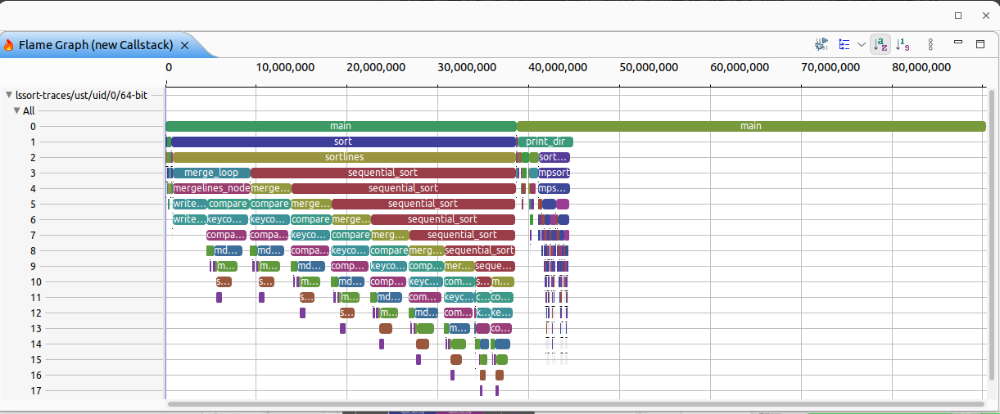
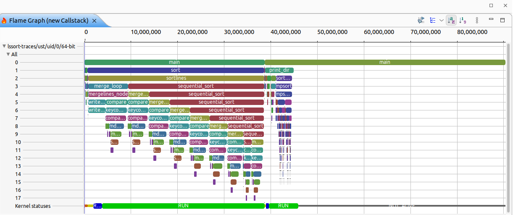

# 13. Flame graph support

Date: 2025-06-12

## Status

Accepted

## Context

This ADR outlines the design of flame graph support in the TSP and the implementation client and server side. Flame graphs exist in classic Trace Compass in Eclipse. Any call stack analysis provides a flame graph. The following image shows the view to be supported in the TSP.



Eclipse Trace Compass's flame graph data provider for LTTng UST shows also Linux kernel states if the experiment contains both LTTng UST and Kernel. This is domain specific, but it illustrates the potential of such a view.



There are 2 possibilites to support the flame graph in the TSP.

### Solution 1: New flame graph data provider type

The view itself is very similar to data providers of type `TIME_GRAPH`. The main difference is that the x-axis is the duration and not time. The Trace Compass back-end currently has such a data provider available with the same API than `TIME_GRAPH` data providers. However, this data provider is not exposed to the server through the `getDescriptor()` method of the corresponing data provider factory. It will need a new type to be added to the `ProviderType` enum.

With this solution the existing endpoint `TIME_GRAPH` endpoint can be agumented or similar endpoints can be defined which have the advantage that the endpoints and data structures are known. Back-end filtering and highlighting would be supported out of the box. 
Assuming the `Provider Type` re-uses `timegraph` the endpoints for the flame graph will be as below:

```
    POST /experiments/{expUUID}/outputs/{outputId}/styles
    Get the styles defined for this data provider

    GET /experiments/{expUUID}/outputs/{outputId}/annotations
    Get list of annotation categories for this view

    POST /experiments/{expUUID}/outputs/{outputId}/annotations
    Get list of annotation for a given annotation categories for this view

    POST /experiments/{expUUID}/outputs/timegraph/{outputId}/tree
    Returns the gantt chart entry model

    POST /experiments/{expUUID}/outputs/timegraph/{outputId}/states
    Returns the states from the for given entries

    POST /experiments/{expUUID}/outputs/timegraph/{outputId}/tooltip
    Get detailed information of a state or annotation
```

**Note**:

- This solution will allow us to fetch the data for the time range of the whole trace and a selected time range. Since the flame graph data is limited in size (in comparison to regular time graphs), all the data can fetched once and all the zooming is done in FE only.
- The annotation endpoints and styles endpoint are independent of the chart type (`TIME_GRAPH`) and can be provided for any chart type. 
- The endpoints and data structures for the time based gantt chart (providerType `TIME_GRAPH`) are designed around timestamps. For example, states have a start and end, or annotations have a `start` and `duration`, or query parameter `requested_time_range` is meant for time stamps. Those names should be more generic, i.e. instead of `duration` it should be `delta`, instead of `requested_time_range` it should be `requested_range` and so on. Having generic names it won't be necessary to duplicate endpoints, data structures etc. for different x-axis.  
- To be able to get a flame graph for a given time range of the trace the `requested_time_range` should be used for that and a new query parameter `requested_range` for the view range (see bullet above).
- Arrows for flame graph won't make make sense and don't need to be supported.

#### Visualization

To visualize the flame graph data in the theia-trace-extesion, a new react commponent should be implemented either using timeline-chart library (similar to the `TimegraphOutputComponent`). Alternatively, the new react component can implement or use an existing flame graph library, for example [d3-flame-graph](https://www.npmjs.com/package/d3-flame-graph/).

#### Example implementation

The Trace Compass mainline already has a flame graph data provider and data provider factory:

- [Flame Graph Data Provider Factory](https://github.com/eclipse-tracecompass/org.eclipse.tracecompass/blob/master/analysis/org.eclipse.tracecompass.analysis.profiling.core/src/org/eclipse/tracecompass/internal/analysis/profiling/core/flamegraph/FlameGraphDataProviderFactory.java)
  - It misses the implementation of `getDescriptors()` 
- [Flame Graph Data Provider](https://github.com/eclipse-tracecompass/org.eclipse.tracecompass/blob/master/analysis/org.eclipse.tracecompass.analysis.profiling.core/src/org/eclipse/tracecompass/internal/analysis/profiling/core/flamegraph/FlameGraphDataProvider.java)
  - It uses `requested_time_range` for x-axis query parameter
  - It uses query parameter `selection_range` to specify the time range in the range to calculate the flame graph. This is for the selection range flame graph. This one doesn't exist in the TSP.
  - It uses query parameter `group_by` to sepcify the grouping strategy (see chapter [Custom Aggregation](#custom-aggregation)).
  - It uses query parameter prefix for tooltip actions `actions` to construct an action (e.g. go to min) see chapter [Actions](#actions) for more details about it.

### Solution 2: New weighted tree data provider tpye

The data of the flame graph could be expressed as a weighted tree. In fact the flame graph data provider above uses an weighted tree implementation to serve the API methods. In this solution, a new weighted tree data provider type should be exposed in the TSP. To achieve that the `DATA_TREE` data provider type needs to be extend to describe which column contains the weight values. The flame graph can then be built by traversing the tree to fill the flame graph view.

Since data providers of `DATA_TREE` don't need any styles, the colors for the flame graph derived from the weighted tree are not defined. So, to have consistent colors to the `Flame Chart`, the data tree will need a `fetchStyles` endpoint which has to be added.  

The existing data tree endpoints are not sufficient. New endpoints need to be added for tooltip etc. No support for back-end supported annotation or arrows.

```
    // Existing endpoints. 
    POST /experiments/{expUUID}/outputs/data/{outputId}/tree
    Returns the gantt chart entry model

    // End point exists, however each data provider needs to support this if applicable
    POST /experiments/{expUUID}/outputs/{outputId}/styles
    Get the styles defined for this data provider

    // New endpoints
    POST /experiments/{expUUID}/outputs/data/{outputId}/tooltip
    Get detailed information of a row (or cell).
```

**Notes**
- The `DATA_TREE` endpoint will fetch the whole data in one query. Since the flame graph data is limited this won't be an issue
- The `DATA_TREE` endpoint has timebased query parameter `requested_time_range` to fetch the flame graph for a specific time range.
- Using the data tree endpoint it will be easier and more intuitive to define custom views for the same data. Annotations are not supported, however the generic endpoint for annotations (see solution 1) could be re-used. Applicable FE visualization can then show them where it make sense. An arrows (links) endpoint would not really make sense when using a data tree.
- To get the tooltip of state, the FE state needs to have pointers to the data tree entry (row) to be able query the back-end  

#### Visualization

To visualize the data weighted `DATA_TREE` data as flame graph in the theia-trace-extension, a new react commponent should be implemented either using timeline-chart library (similar to the `TimegraphOutputComponent`). Alternatively, the new react component can implement or use an existing flame graph library, for example [d3-flame-graph](https://www.npmjs.com/package/d3-flame-graph/.

### Other considerations

#### Custom Aggregation
Flame graphs can have different schemes for aggregation of layers, e.g. per process ID, threads or full aggregation, which will change the tree and duration values of each segment. Changing the aggregation scheme needs to be part of the TSP protocol, i.e. the flame graph data provider needs to provide the available aggregation schemes and there needs to be a query parameter or path parameter to specify which one to apply in the back-end.

The data provider descriptor capabilities can be augmented to indicate if a data tree can change the aggregation scheme. With this in place we can define how the possible groupings are provided by the server to the client, and how the client provides the aggregation scheme. 

Aggregation will have to be supported in either of the solutions above.

#### Weight metric

Please note that the weight metric of the flame graph and weighted tree in the description above is duration. However, the weight metric can be another metric, e.g. number of calls, bytes allocated, number of page faults. The solution should allow those use cases. To support that there needs to be a description of the metric used so that the visualization is adapted accordingly (e.g. show the correct units).

#### Actions

The Flame Graph in Trace Compass has built in statistics, that allows to navigate to the time range of the minimum or maximum duration in the trace. For solution one, the statistics are shown as part of the segment tooltip which is queried on demand. The min/max time range has to be encoded in the tooltip and the UI needs to be able to understand that this is an action. For that we need to define a action indicator (e.g. prefix #ACTION or similar). 

For the data tree solution, the statistics could be provided as tooltip on the row as well. For that a new tooltip endpoint for data trees is required. The action design would be the same as in solution 1.

## Decision

Flame Graph support will be added. Re-using the flame graph data provider (solution 1) will allow client FE to leverage existing gantt chart view implementation. It also provides known APIs. The endpoint will support the `requested_time_range` query parameter to get the Flame Graph for a selected time range. If omitted the Flame Graph for the whole trace will be shown.

Implementing support of a weighted tree is also useful to have with or without implementing solution 1. It should be added in any case. Note, that the Trace Compass trace server back-end doesn't aready have such data provider. To create a flame graph from the weighted tree would put more processing to the FE client. However, configurations like aggregation scheme would only be needed to be done once.

The decision is to implement solution 1 for a dedicated endpoint for the flamecharts. The weighted tree support as part of the `DATA_TREE` endpoint will be implemented later.

## Consequences

Flame Graphs are important profiling views for analyzing performance of applications. Adding those will help developers find performance bottlenecks faster.
