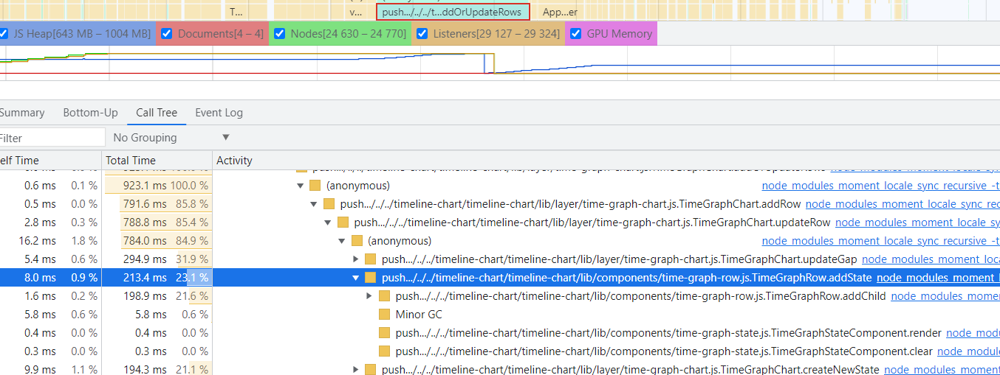
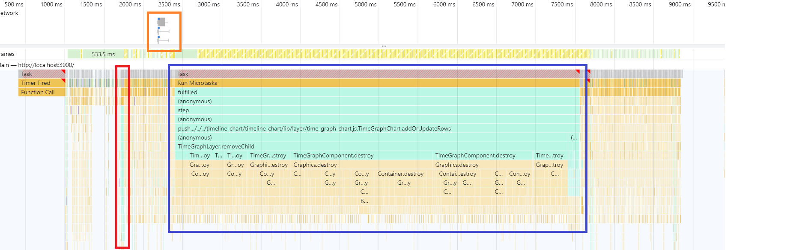
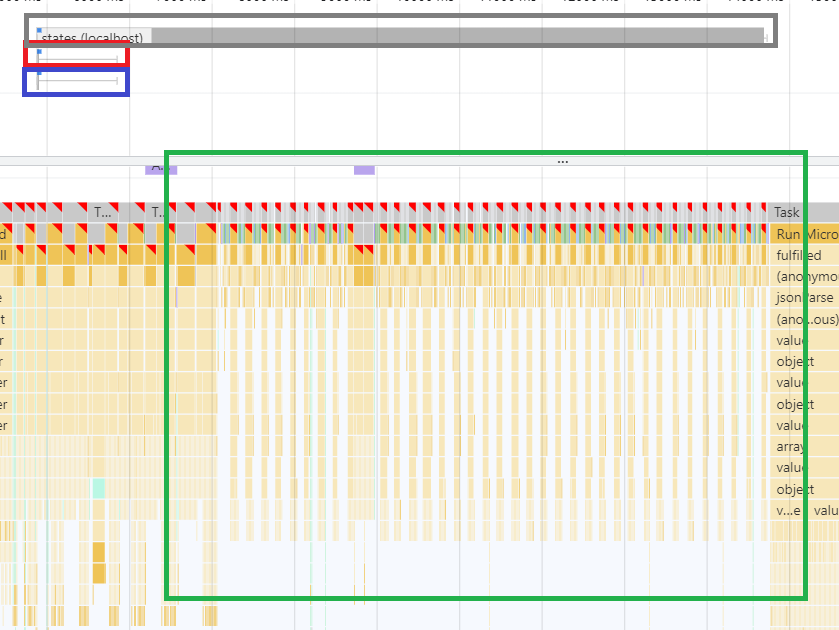
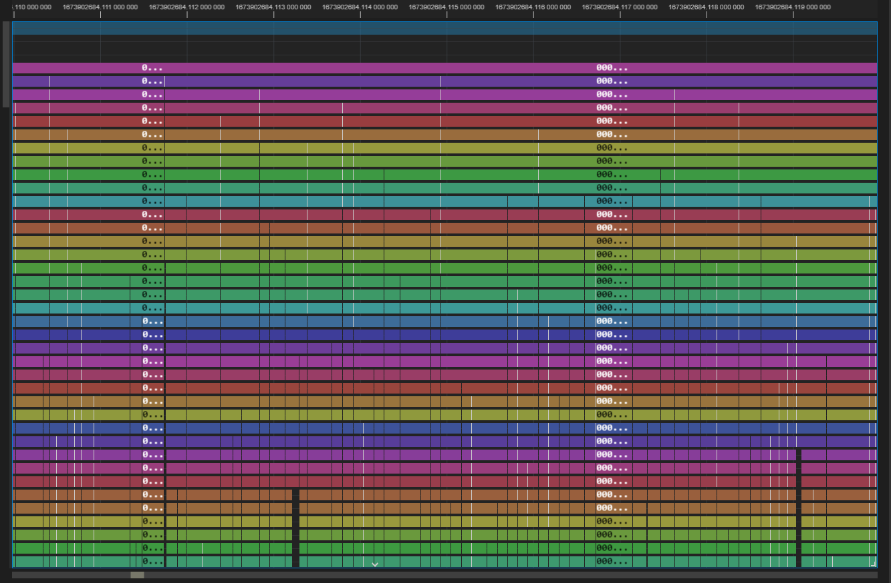
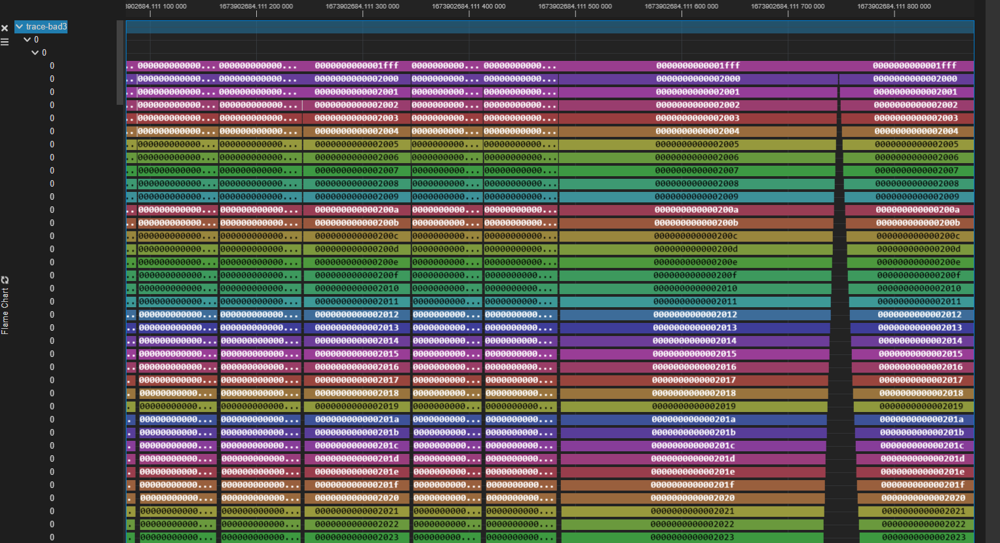
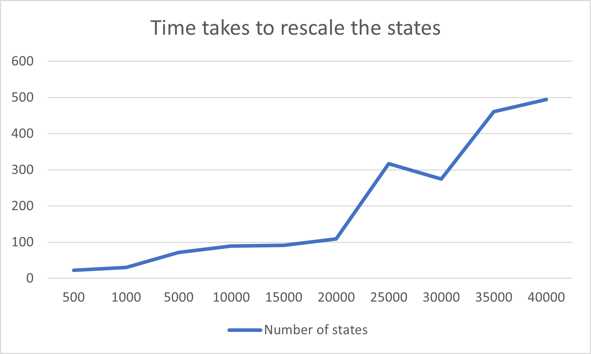
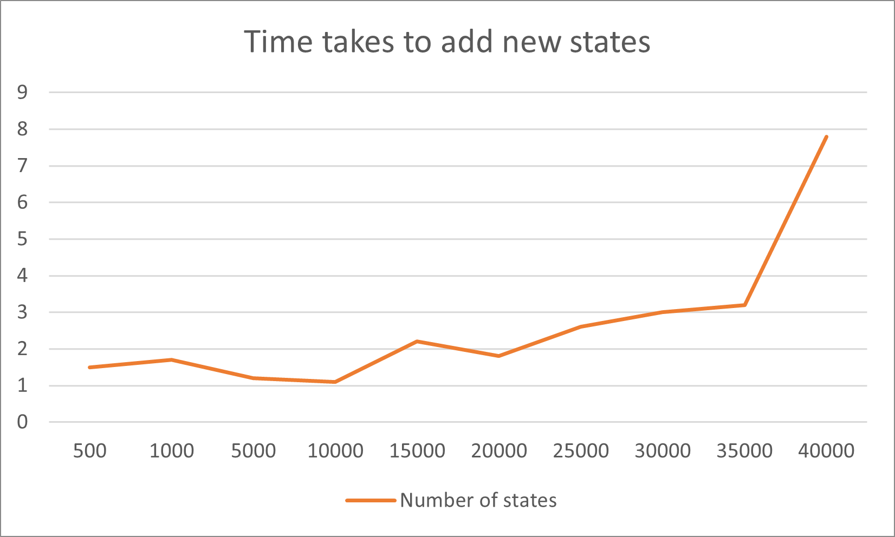
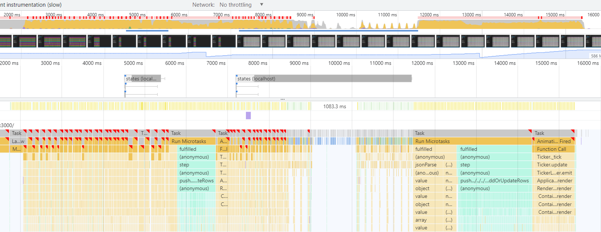
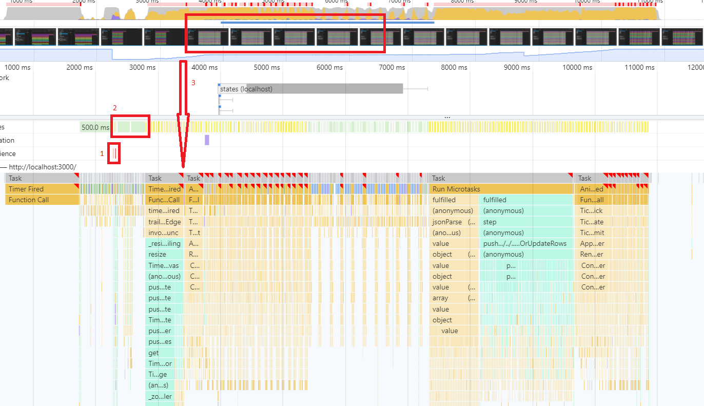

# Performance analysis of timeline chart

Date: 2023-02-07

## Overview

When zooming/resizing/panning with the timeline chart, the Trace Extension might become unresponsive for a while. This might last from 1-2 seconds, or make the trace extension unresponsive. It looks like the more states that the timeline chart needs to render, the slower the responsiveness becomes. This document is an attempt to analyze and identify the bottlenecks that might be the cause of this issue, as well as providing reproducible tests and results so that future improvements can be easily measured based on the statistics in this document.

### Test set up and requirements

#### Hardware setup

```text
Computer:
                                ..,
                    ....,,:;+ccllll   -------------------------------
      ...,,+:;  cllllllllllllllllll   OS: Windows 10 Pro x86_64
,cclllllllllll  lllllllllllllllllll   Host: Dell Inc. Latitude 5420
llllllllllllll  lllllllllllllllllll   Kernel: 10.0.19044
llllllllllllll  lllllllllllllllllll   Uptime: 4 days, 22 hours, 21 mins
llllllllllllll  lllllllllllllllllll   Packages: 4 (scoop)
llllllllllllll  lllllllllllllllllll   Shell: bash 4.4.23
llllllllllllll  lllllllllllllllllll   Resolution: 1920x1080, 1920x1080
                                      DE: Aero
llllllllllllll  lllllllllllllllllll   WM: Explorer
llllllllllllll  lllllllllllllllllll   WM Theme: Custom
llllllllllllll  lllllllllllllllllll   CPU: 11th Gen Intel i5-1145G7 (8) @ 1.500GHz
llllllllllllll  lllllllllllllllllll   GPU: Caption
llllllllllllll  lllllllllllllllllll   GPU: Intel(R) Iris(R) Xe Graphics
`'ccllllllllll  lllllllllllllllllll   GPU: Citrix Indirect Display Adapter
       `' \*::  :ccllllllllllllllll   GPU
                       ````''*::cll   Memory: 24368MiB / 32145MiB
                                 ``

Monitor: LG Monitor model 27MP58VQ-P/ FullHD resolution.
```

#### Profiling tool

Chrome performance tool is used as the profiling tool. The tool can be opened by selecting the `Performance` tab in the Chrome Developer Tools.

In addition, the call tree view of the profiling tool is quite useful, as it let us view the aggregated amount time that is taken to run a certain function. In the screenshot below, the call tree view is used to find the total time took to add new states to the timeline chart. Note that the function `addOrUpdateRow()` is highlighted (red rectangle) first before expanding the call tree.



#### Sample trace

A sample trace called `trace-bad` is attached to the pull request. You can find it [here](https://github.com/eclipse-cdt-cloud/theia-trace-extension/pull/923). The trace has a large amount of states so that it can overload the processing of the timeline chart. The trace is used for all of the tests that will be performed below.

### About tests

Tests and parameters of each test will be provided in the sections below. It is important to note that because each screen is different, and there is no precise way to set the view range yet, the results of each test may vary slightly. Therefore, some parameters are provided with the test so that each test can be reproduced as precised as possible. For large number of states (when the trace is quite zoomed out and no labels are present), the variation might be larger. Luckily, for smaller number of states (when the trace is zoomed in so that almost all states have a label), the variation is quite small.

For most case, there will be a test with and without label. The reason is that when we are quite zoom in, the labels are displayed, but there is not a lot of states on the screen. The opposite is also true. Therefore, to make sure than we take as much factors into consideration as possible, there will be at least 2 tests for each experiment.

Personally, because each set up is different, to test a performance improvement, I suggest running the test on your local machine prior to your performance improvement, record the numbers, then try again with the improvement, record the new numbers and compare. I think this is the best approach.

### Commit SHAs

As the time the tests in this document are done, the Trace Extension is at commit `4aa0d74480ec034c2a82cd15fb4751257b603832` and the timeline chart is at commit `672d6b642f034a0c226949702f46371a12d47904`.

## Zooming analysis

First, I tried running the Chrome profiler with the following parameters as an attempt to analyze the performance of the timeline chart when zooming.

```text
Test 1
1 Zoom
Starting range = [1673902683.805 000 000; 1673902683.808 000 000]
Number of states rescaled ~= 8261 states
Number of rows = 45 rows
Number of states removed upon update ~= 4578 states
Number of states added upon update ~= 3528 states
Most states have label pre-zoom
All states should have a label text post-zoom
```

When the user trigger a zoom-in, the following actions are performed sequentially.



1. Zoom handlers are triggered. The elements in the chart are updated, including rescaling and repositioning of the states by calling the function `updateScaleAndPosition()` (red).
2. The timeline chart then fetches new data from the server (orange).
3. Once the new data arrived, the chart is updated again by calling `addOrUpdateRows()` (blue).

From the profiling results, we see that `addOrUpdateRows()` takes the most amount of time, which is `5.15s`, and is marked as a long task by the profiler. In this case we see that `updateScaleAndPosition()` takes `29.75ms`. If we run the test a few more times, sometimes this function will also be marked as a long task (See test 2).


```text
Test 2
1 zoom
Range = [1673902684.000 000 000; 1673902684.500 000 000]
Number of states changed ~= 116620 states
Number of rows = 45 rows
Number of states removed upon update ~= 112311 states
Number of states added upon update ~= 139401 states
```

When zooming in with larger number of states, the `updateScaleAndPosition()` function is also marked as a long task, taking `737.28ms`. Also the HTTP response that returns the new state data also took `7.83s`.

Hence we have 3 places for investigation: [rescaling and repositioning of the states](#rescaling-and-repositioning-of-the-states), [communication delay](#communication-delays) and [chart update after fetching data](#updating-the-states-after-fetching-new-data).

### Rescaling and repositioning of the states

From the profiling attempts above, using the call tree view, we have the top 3 time-consuming operations done by the `updateScaleAndPosition()` function. It looks like the function spent a considerable amount of time updating states by calling `TimeGraphStateComponent.update()` and `getWorldPixel()`. Updating gap is similar to  `TimeGraphStateComponent.update()` because a gap in the code is also a TimeGraphStateComponent. The number below is from running Test 1 again.

|Operation|Time (ms)|Percentage compared to updateScaleAndPosition()|
|---|---|---|
|Update state|11.8|39.7%|
|Get world pixel|6.1|20.4%|
|Update gap|1.3|4.3%|

Digging deeper, out of the `11.8ms` spend updating the state, the timeline chart spends `4.7ms` rendering the rectangular boundaries and `2.4ms` to render the labels.

#### Updating states

Let's run a few tests to get more accurate statistics on the time spent updating the states. This does not include the time took to add/update/remove gaps.

```text
Test 1
1 zoom
Range = [1673902683.805 000 000; 1673902683.808 000 000]
Number of states rescaled ~= 8261 states
Number of rows = 45 rows
Number of states removed upon update ~= 4578 states
Number of states added upon update ~= 3528 states
Most states have label pre-zoom
All states should have a label text post-zoom
```

||Update element (ms)|updateScaleAndPosition() (ms)|Percentage compared to updateScaleAndPosition()|
|---|---|---|---|
|Attempt #1|17.9|63.5|28.2%|
|Attempt #2|24.6|40.8|60.3%|
|Attempt #3|13.3|27.7|48.0%|
|Average|18.6|44|45.5%|

```text
Test 2
1 zoom
Range = [1673902684.000 000 000; 1673902684.500 000 000]
Number of states changed ~= 116620 states
Number of rows = 45 rows
Number of states removed upon update ~= 112311 states
Number of states added upon update ~= 139401 states
No visible text labels
```

||Update element (ms)|updateScaleAndPosition() (ms)|Percentage compared to updateScaleAndPosition()|
|---|---|---|---|
|Attempt #1|317.6|910.5|34.88%|
|Attempt #2|366.7|922.8|39.7%|
|Attempt #3|326.1|903.9|36.1%|
|Average|336.8|912.4|36.9%|

From the data above, it looks like the time took to render the states is around `35-45%`. Running Test 1 and 2 again one more time and use the call tree view, we can get the following data:

|Operation|Time (ms)|Percentage compared to updateScaleAndPosition()|
|---|---|---|
|Test 1||
|Clearing PIXI graphics|5.5|15.6%|
|Render rectangle|3.7|10.6%|
|Render label|1.6|4.6%|
|Test 2||
|Clearing PIXI graphics|154.4|14.3%|
|Render rectangle|206.7|20.3%|
|Render label|0.5|0.1%|

We see that in both case, with or without labels, clearing PIXI graphics takes around `15%` of the total time of the function `updateScaleAndPosition()`. Next, depending on the amount of states that needs to be rendered, the time to render the rectangular border of each state can take a significant amount of time (20.3% in our second test). Note that rendering labels does not take much amount of time in both cases. In test 1, all states should have their labels displayed, but the time took to render the labels is only `4.6%`. In test 2, there should not be any text labels, which explains almost no time consumption.

#### Get world pixel

Running test 1 and 2 again to gather statistics for the `getWorldPixel()` function.

||getWorldPixel() time (ms)|updateScaleAndPosition() time (ms)|Percentage compared to updateScaleAndPosition()|
|---|---|---|---|
|Test1|||
|Attempt #1|12.8|35|36.6%|
|Attempt #2|14.8|42.4|34.9%|
|Attempt #3|11.6|38.5|30.2%|
|Average|13.1|38.6|33.9%|
|Test2|||
|Attempt #1|272.1|1019.8|26.7%|
|Attempt #2|210.79|760.29|27.7%|
|Attempt #3|245.7|1037|23.63%|
|Average|242.9|939.03|23.01%|

From the data, we see that the aggregated time took to run `getWorldPixel()` takes up on average `23.01-33.9%` of the time running the `updateScaleAndPosition()`. I digged a bit deeper into the code of the `getWorldPixel()` function, and found out that this function calls the `getPixel()` function,  which performs some mathematical operations with BigInt. BigInt operations are significantly slower than operation with primitive types. With a large number of operation (because we process a large number of states), this might be a bottleneck.

```typescript
protected getPixel(time: bigint) {
    const div = 0x100000000;
    const hi = Number(time / BigInt(div));
    const lo = Number(time % BigInt(div));
    return Math.floor(hi * this.stateController.zoomFactor * div + lo * this.stateController.zoomFactor);
}
```

### Communication delays

To investigate the delays in network activity, we perform test 1 and 2 again. This time looking the network section in the Chrome profiling results:



Grey: States data

Red: Annotations data

Blue: Arrows data

Green: Idle time

||States|||Annotations|||Arrows|||
|---|---|---|---|---|---|---|---|---|---|
||Network transfer(ms)|Resource loading(ms)|Total(ms)|Network transfer(ms)|Resource loading(ms)|Total(ms)|Network transfer(ms)|Resource loading(ms)|Total(ms)|
|Test1|
|Attempt #1|104.44|34.84|139.28|10.57|194.52|205.09|10.21|194.61|204.82|
|Attempt #2|103.40|43.09|146.49|12.15|122.54|134.68|10.85|122.83|133.68|
|Attempt #3|103.97|44.84|148.82|10.47|132.81|143.29|8.67|132.89|141.56|
|Average|103.94|40.92|144.86|11.06|149.97|161.02|9.91|150.11|160.02|
|Test2|
|Attempt #1|6340|14.51|6360|12.73|507.62|520.36|11.89|508.24|520.14|
|Attempt #2|7210|16.13|7220|11.23|497.14|508.38|9.01|497.04|506.05|
|Attempt #3|8820|49.38|8870|11.34|986.19|997.53|11.10|986.19|997.29
|Average|7456.67|26.67|7483.33|11.77|663.65|675.42|10.67|663.82|674.49|

Comparing test 1 and 2, we see that:

1. The time spent waiting for HTTP response increases as the number of states increases for all three categories.
2. For fetching states data, the time spent on network transfer takes up the majority of the time, while loading the resources takes up little time. As a percentage, network transfer takes up `71.75%` and `99%` of the time on average while resource loading only takes up `28.25%` and `1%` of the time, for test 1 and 2 respectively.
3. Meanwhile, for loading annotations and arrows, the resource loading time is significantly larger, and increases with the number of states. The network transfer time to fetch the data remains similar in both tests. Meanwhile, the resource loading time for annotations is `663.65ms` or `98.26%`, and for arrows is `663.82ms` or `98.42%` of the time (on average).
4. While waiting for the states data, the timeline does not do anything. This is time wasted.

### Updating the states after fetching new data

After the timeline finishes rescaling the elements on the canvas, it will fetch the new trace data from the server. Then the timeline chart will clear all the states, and rerender everything.

```text
Test 1
First, set the view range to the range indicated in the first column below.
Then perform a single zoom.
Various numbers/parameters are indicated in the table to help reproduce the test.
```

Both:
|Range|updateScalesAndPosition()||addOrUpdateRows()||||||Text label amounts|
|---|---|---|---|---|---|---|---|---|---|
||Duration(ms)|Number of states updated|Remove duration(ms)|Number of states removed|Removal time per state(ms)|Add duration(ms)|Number of states added|Add time per state(ms)||
|Full trace range|137.2|20112|18|19304|0.0009|286.7|24286|0.0118|1 visible text label|
|[84;84.5]|868.4|116121|256.5|111270|0.0023|1376|138451|0.0099|None|
|[84.100;84.200]|679.1|120828|100.5|114682|0.0009|2226.3|93889|0.0237|None|
|[84.110;84.120]|58.9|16170|1339.7|10962|0.1222|431.2|8694|0.0496|Some|
|[84.1110;84.1111]|2.8|381|456.4|210|2.173|2.2|210|0.0105|All states have labels|

```text
Test 2
Set view range to the full range (using the home button).
Perform 5 consecutive zoom, and record the information in between.
Various numbers/parameters are indicated in the table to help reproduce the test.
There should be only 1 text label for the very first row of the timeline chart.
```

|Range|updateScalesAndPosition()||addOrUpdateRows()||||||
|---|---|---|---|---|---|---|---|---|
||Duration(ms)|Number of states updated|Remove duration(ms)|Number of states removed|Removal time per state(ms)|Add duration(ms)|Number of states added|Add time per state(ms)|
|1st zoom|142.3|20112|16.2|19304|0.00083|206.4|24285|0.00850|
|2nd zoom|136.2|25106|20.7|24285|0.00085|358.9|30267|0.01185|
|3rd zoom|178.2|31372|28.5|30267|0.00094|490.3|37729|0.01300|
|4th zoom|193.2|39131|33.3|37729|0.00088|543.6|46851|0.01116|
|5th zoom|323.4|48749|38.5|46851|0.00082|626.4|58299|0.01074|

```text
Test 3
Set view range to the range  [1673902684.1100 000 000; 1673902684.112 000 000]
Perform 5 consecutive zoom, and record the information in between.
Various numbers/parameters are indicated in the table to help reproduce the test.
There should be label texts present.
```

The first zoom is after a new view range selection. All states here has labels.

|Range|updateScalesAndPosition()||addOrUpdateRows()||||||
|---|---|---|---|---|---|---|---|---|
||Duration(ms)|Number of states updated|Remove duration(ms)|Number of states removed|Removal time per state(ms)|Add duration(ms)|Number of states added|Add time per state(ms)|
|1st zoom|25|4465|5430.4|2394|2.2683|63.3|2016|0.0314|
|2nd zoom|20.8|3830|4784.3|2016|2.3792|42.9|1638|0.0262|
|2nd zoom|13.4|3118|3831.1|1638|2.3388|41.5|1386|0.0299|
|4th zoom|11.6|2651|3148|1386|2.2723|36.9|1176|0.0314|
|5th zoom|13.4|2260|2630.1|1176|1.3861|25.5|966|0.0264|

There are some interesting observation when viewing the results of the 3 tests:

#### Removing states

If we look at the results for test 1, we see that it took `100.5ms` to remove `114682 states` while it took `1339.7ms` to remove `10962 states`. That is `0.0009ms` per the removal of 1 state. It looks like the cost of removing a state is linearly correlated with the number of states.



Looking test 3, where all states has a label (see image below), it took the timeline chart a whooping `5430.4ms` to remove `2394 states`. That is `2.2683ms` per state removal.



#### Adding states

Similarly, we can see that adding states with labels take more time than states without labels. Without labels, the time takes to add a state is about `0.01ms`; however, with labels, the time takes to add a single state ranges from `0.0264-0.0314ms`. That is about double or triple the time of adding states without labels.

## Investigation of state count threshold

A number of states displayed on the screen is definitely a big bottleneck of the performance of the timeline chart. The more number of states that the chart needs to display, the longer the loading time. This section will try to pinpoint the number of states where the performance of the timeline chart starts to suffer.

```Text
Test
In the code, add a limit on the number of states that the function updateScaleAndPosition() and addOrUpdateRow() can add/modified. 
Then run trace extension, open the Flame Chart and perform a zoom at the specified range below.
The number of row should be 45.
Records the time took update the states and to add the states to the canvas after fetching new data. 
Reset and perform the test again with a new threshold.
```

|Range|Threshold(states)|updateScaleAndPosition()<sup>1</sup> (ms)|addOrUpdateRow()<sup>2</sup> (ms)|
|---|---|---|---|
|Full range|500|22.5|1.5|
|Full range|1000|30.4|1.7|
|Full range|5000|71.3|1.2|
|Full range|10000|89.5|0.9|
|Full range|15000|91.2|2.2|
|Full range|20000|108.8|1.8|
|Changing range else we will not get 25000 states||
|[1673902684.000 000 000; 1673902684.500 000 000]|25000|316.7|2.6|
|[1673902684.000 000 000; 1673902684.500 000 000]|30000|274.3|3|
|[1673902684.000 000 000; 1673902684.500 000 000]|35000|461.1|3.2|
|[1673902684.000 000 000; 1673902684.500 000 000]|40000|494.1|7.8|

<sup>1</sup>: Time takes to update the states in the updateScaleAndPosition() function.
<sup>2</sup>: Time takes to add the states in the addOrUpdateRows() function.



The chart above plots the relationship between the time takes to update states in relation with the number of states. It looks like the performance takes a dip at around 20000 states because the time increase rapidly.



The chart above plots the relationship between the time takes to add new states in relation with the number of states, after the new state data has been fetched. It looks like the performance takes a dip at around 30000 states because the time increase rapidly.

If you are looking at the previous test, especially Test 1 in the [Updating the states after fetching new data](#updating-the-states-after-fetching-new-data) section, sometimes we need to display up to 140000 states in this states or even more, so it looks like we can only display around `1/4` of the actual amount states returned by the server.

## Delay when panning horizontally

```Text
Test
Set the number of rows to 45.
Set the view range to [1673902684.000 000 000; 1673902684.100 000 000] using the right mouse button.
Start the profiler.
Pan the chart to the right until you see an empty area of the chart. Continue panning until you only see a small portion of the chart is rendered (about 1/10th of the chart width).
Wait about 2-3 seconds so that the timeline chart finishes rendering, then stop the profiler.
```

We have the following result:



When user pans the chart, the states data are fetched from the server multiple times, twice in our case. The time waiting for the response is quite slow, `993.21ms` and `4.26ms` for each attempt. After each HTTP response, the `addOrUpdateRows()` function is triggered. The first run took `923.13ms` and the second run took `1.79s`. The performance analysis for this function has already been done in previous section.

## Resizing analysis

To test the performance of resizing the timeline chart, I performed the following test

```
Test
Resize the browser to 1200x500 pixels.
Set the trace range to full range, then refresh the trace extension. 
Make sure that after the refresh, the Flame Chart is still open. 
Set the view range to [1673902684.000 000 000; 1673902684.500 000 000] using the right mouse button.
Start the profiler.
Maximize the browser window.
Wait about 2-3 seconds so that the timeline chart finishes rendering, then stop the profiler.
```

We have the following result:



We see that when the resize action is triggered [1], there is an odd 500ms idle time [2] happening with the timeline chart. I am not sure what it is, so this might need further investigation in the future. The changes in the timeline chart are not seen until the function `updateScaleAndPosition()` finishes running. The performance of this function has been analyzed in previous sections. The function took `617ms` to finish, and with the `500ms` coming from the idle time, it adds up to more than 1s. This explains why user resizes the chart, there is a short time where no changes are visible (see image below).


Another thing to mention is that network activity to fetch states also took 3.37s and the function `addOrUpdateRows()` also took `1.49s`. So resizing is also suffering from the same pain points as zooming.

## Conclusion

From the performance analysis of all the zoom/resize/pan functionality of the timeline chart, the three identified bottleneck for the timeline chart is:

1. Rescaling and repositioning the states in the chart in `updateScaleAndPosition()`:
    - When rescaling the states of the chart, each element is first cleared and then re-rendered.
    - Clearing the PIXI graphics of states take up to `15%` of the running time of the function.
    - Rendering the rectangular border of the states take on average `20%` of the running time of the function.
    - Rendering text labels does not consuming as much time as rendering the rectangular border.
    - The function `getWorldPixel()` takes up on average `23.01-33.9%` of the time running the function due to BigInt operations.

2. Communication delays:
    - The communication delays is proportional to the number of states rendered.
    - For state data, a large proportion of the time is spent waiting for the response to be returned by the server. This ranges from `71.75%` to `99%`.
    - For annotations and arrows data, most of the time is spent on loading the resources, around `98%` of the running time.
    - There might be some idling time where the timeline chart does nothing while waiting for the response.

3. Updating the states post data fetching:
   - Removing PIXI graphics are expensive. This means removing states are much more expensive than adding new states.
   - Removing states with labels are much more expensive then states without labels.
   - From the tests done in this document, removing states with labels can be `2520 times` more expensive than removing states without labels.
   - Adding states with labels can take double or triple the time compared to adding states without labels.

## Improvements made

This section records the improvements that was made to improve the performance of the timeline chart.

### GZIP

GZIP was used to compress the data transfer over the network. On the server side, GZIP sends information to the trace extension as raw **binary** data, instead of converting numeric values into text then send it. This makes the data sent over the network smaller, ultimately making the transfer speed faster. Repeating the tests from [Communication delay section](#communication-delays), we have the following information:

||States|||Annotations|||Arrows|||
|---|---|---|---|---|---|---|---|---|---|
||Network transfer(ms)|Resource loading(ms)|Total(ms)|Network transfer(ms)|Resource loading(ms)|Total(ms)|Network transfer(ms)|Resource loading(ms)|Total(ms)|
|Test1|
|Attempt #1|34.62|29.01|63.64|12.41|66.61|79.02|10.99|67.04|78.03|
|Attempt #2|53.77|8.20|61.97|14.63|28.23|42.86|14.98|27.60|42.58|
|Attempt #3|37.56 |23.37 |60.93 |11.66|30.88|42.54|11.34|30.79|42.12|
|Average pre-GZIP|103.94|40.92|144.86|11.06|149.97|161.02|9.91|150.11|160.02|
|Average post-GZIP|41.98|20.19|62.18|12.9|41.91|54.81|12.44|41.81|54.24|
|Change in time|-61.96|-20.73|-82.68|+1.84|-108.06|-106.21|+2.53|-108.3|-105.78|
|Percentage change|-59.61%|-50.66%|-57.08%|+16.64%|-72.05%|-65.96%|+25.53%|-72.15%|-66.10%|
|Test2|
|Attempt #1|1360|11.98|1370|14.04|333.86|347.89|13.36|332.96|346.32|
|Attempt #2|1390|13.32|1400|13.55|281.54|295.09|12.70|281.72|294.42|
|Attempt #3|2040|20.31|2060|9.88|834.65|844.53|9.26|835.11|844.37|
|Average pre-GZIP|7456.67|26.67|7483.33|11.77|663.65|675.42|10.67|663.82|674.49|
|Average post-GZIP|1596.67|15.20|1610|12.49|483.35|495.84|11.77|483.26|495.04|
|Change in time|-5860|-11.47|-5873.33|+0.72|-180.3|-179.58|+1.1|-180.56|-179.45|
|Percentage change|-78.59%|-43.01%|-78.49%|+6.12%|-27.17%|-26.59%|+10.31%|-27.20%|-26.61%|

For test 1, which has a smaller number of states:

- With GZIP added, the transfer time of states data, which is the bottleneck of network activity, decreases `57.08%`, or around `82.68ms`. On the other hand, the network transfer time of arrows and annotations increased by `6.64%` and `25.53%` respectively. However, this increase corresponds to only 2-3ms, which is acceptable. Looks like for smaller requests, we might have some increase in network transfer time though minimal.
- The resource loading time also decrease significantly for all three types of network transfer, from `50-70%`, which mean that for annotations and arrows data we take significantly less time to load the resources.

For test 2, which has a much larger number of states:

- With GZIP added, the transfer time of states data decreases `78.59%`, or around `5860ms=5s`. This is a huge improvement. Similar to the results of test 1, the network transfer time of annotations and arrows has a slight increase in time, but also minimal.
- The resource loading time also decrease significantly for all three types of network transfer, `43.01%` for states data and `27.00%` for the two remaining data.

### Replacing re-rendering with scaling

#### The issue

When zooming, before new data is received from the trace server, states are re-rendered to create zoom animations. More on this issue [here](#rescaling-and-repositioning-of-the-states).

#### The solution

Instead of re-rendering all the states, `PIXI.Container.scale` property can be used to create the zoom animations. See [this PR](https://github.com/eclipse-cdt-cloud/timeline-chart/pull/246) for more details.

#### Results

Before (unit tests):

|Test|Without labels(ms)|With labels(ms)|
|---|---|---|
|Attempt 1|589.93|25.90|
|Attempt 2|705.59|34.76|
|Attempt 3|2768.89|65.49|
|Average|1354.8|42.05|

After (unit tests):

|Test|Without labels(ms)|With labels(ms)|
|---|---|---|
|Attempt 1|8.49|30.19|
|Attempt 2|7.45|52.31|
|Attempt 3|6.97|40.07|
|Average|7.64|40.85|

Using the performance profiler in Chrome, the time to scale the states in the timeline chart after the improvement are:

```text
Test 1 (with labels): 38.32ms
Test 2 (without labels): 10.3ms
```

For the test descriptions, see [here](#rescaling-and-repositioning-of-the-states).

### State label rendering

#### The issue

After new data is received from the trace server, all rows are updated: current states are removed, and then all states are re-rendered. Initially, for each state, the trace extension creates a new `PIXI.BitMapText` to determine whether the label text would fit inside the state (if the width of the state is larger than the minimum display width). Thus, every `TimeGraphStateComponent` will contains a `PIXI.BitMapText` object, even if the label text is not displayed. This means that when we have a huge amount of states, then we would have a huge amount of `PIXI.BitMapText` objects, that need to be disposed by the garbage collector when the states are removed. This consumes a lot of time as described [here](#updating-the-states-after-fetching-new-data) (look at the state removal time).

#### The solution

To improve the performance of the timeline chart, use `PIXI.TextMetrics.measureText()` to calculate the width of the label text instead. Since this is a static method, there is no need to create an object every time the method is call. See [this PR](https://github.com/eclipse-cdt-cloud/timeline-chart/pull/242) for more details.

#### Results

The patch made a significant difference in cases where the user zooms in when the before and after view range have a significant different amount of states (the long removal column).

Before (unit tests):

|Test|Without labels(ms)|With labels(ms)|Long removal(ms)|
|---|---|---|---|
|Attempt 1|1678.87|247.41|63456.54|
|Attempt 2|2623.54|255.92|56458.29|
|Attempt 3|3082.13|138.45|66287.67|
|Average|2461.51|213.93|62067.5|

After (unit tests):

|Test|Without labels(ms)|With labels(ms)|Long removal(ms)|
|---|---|---|---|
|Attempt 1|4111.77|174.97|455.56|
|Attempt 2|2965.95|174.49|582.48|
|Attempt 3|2738.03|369.81|378.77|
|Average|3271.91(*)|239.76(**)|472.27|

Using the performance profiler in Chrome, the time for removing existing states and rendering new states (after the improvement) are:

```text
Test 1 (with labels): 96.61ms
Test 2 (without labels): ~1910ms
```

For the test description, see [here](#updating-the-states-after-fetching-new-data).

(*) In the case of without labels, since the state width is less than the minimum width to display labels for all the states, there is no usage of `PIXI.BitMapText` to measure the width of the label text. Thus, the performance stays the same.

(**) For this test case, if we run the tests multiple times, the running time falls between the range of 100ms-400ms for both the Chrome profile and the unit tests.
